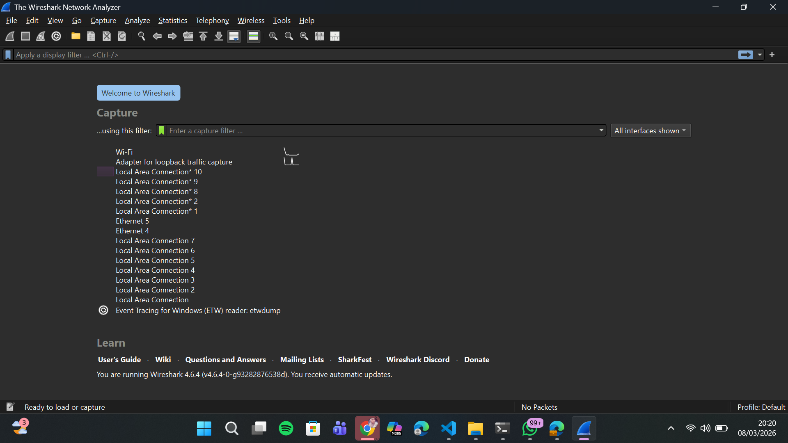
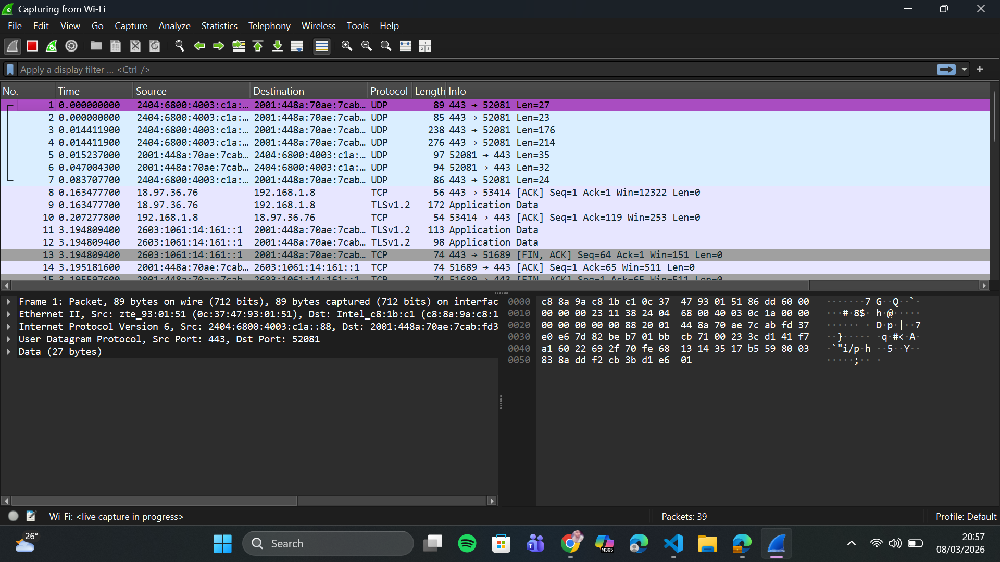
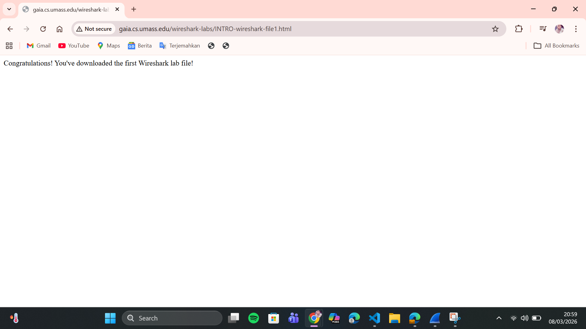
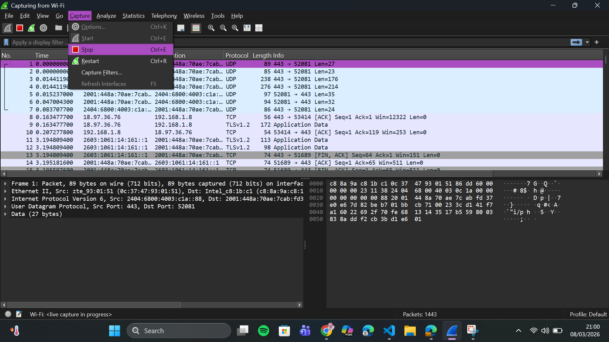
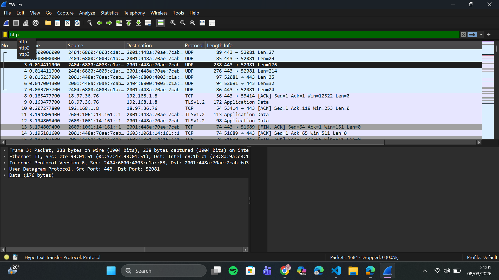
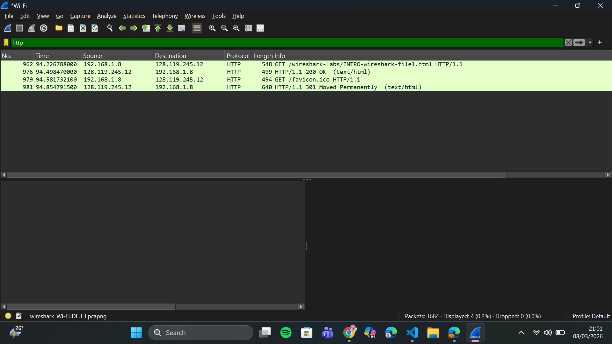

# LAPORAN PRAKTIKUM MODUL 2 : PENGENALAN TOOLS

## Tujuan Praktikum
Mengenal dan menggunakan fitur dasar Wireshark untuk menangkap dan menganalisis paket jaringan.

## Alat dan Bahan
- Wireshark (http://www.wireshark.org/)
- Browser web
- Koneksi internet

## Langkah Percobaan
1. Install dan buka aplikasi Wireshark
2. Pilih interface **Wi-Fi** lalu mulai capture paket
3. Buka browser dan akses:
   `http://gaia.cs.umass.edu/wireshark-labs/INTRO-wireshark-file1.html`
4. Kembali ke Wireshark lalu hentikan capture
5. Ketik `http` pada kolom filter untuk menampilkan hanya paket HTTP
6. Amati paket yang muncul, khususnya HTTP GET dan responnya

## Hasil dan Pembahasan

### 1. Instalasi dan Membuka Aplikasi Wireshark

Wireshark berhasil diinstall dan dibuka.

### 2. Memilih Interface Wi-Fi dan Memulai Capture
Interface **Wi-Fi** dipilih untuk mulai menangkap paket jaringan.

### 3. Mengakses Website Percobaan

Browser dibuka dan mengakses halaman percobaan untuk menghasilkan aktivitas jaringan.

### 4. Menghentikan Proses Capture

Capture dihentikan setelah halaman berhasil dimuat.

### 5. Menggunakan Filter HTTP

Filter `http` diterapkan agar hanya paket HTTP yang ditampilkan.

### 6. Hasil Paket HTTP

Terlihat paket **HTTP GET** dari client ke server dan respons **200 OK** dari server yang menandakan permintaan berhasil.

## Kesimpulan
Wireshark berhasil digunakan untuk menangkap dan menganalisis paket jaringan. Proses komunikasi HTTP antara browser dan server berhasil terekam, ditandai dengan munculnya status **200 OK** pada respons server.