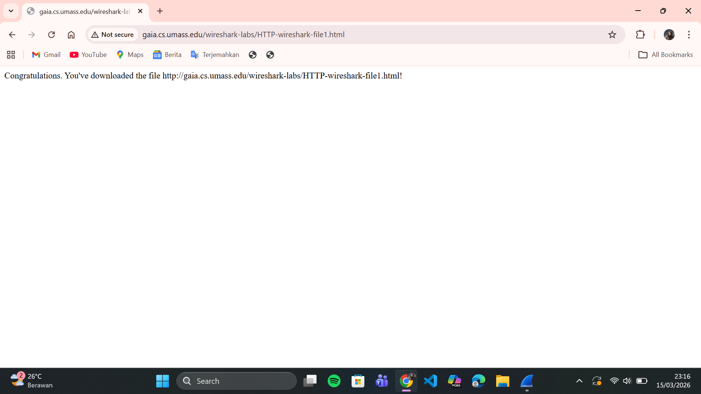
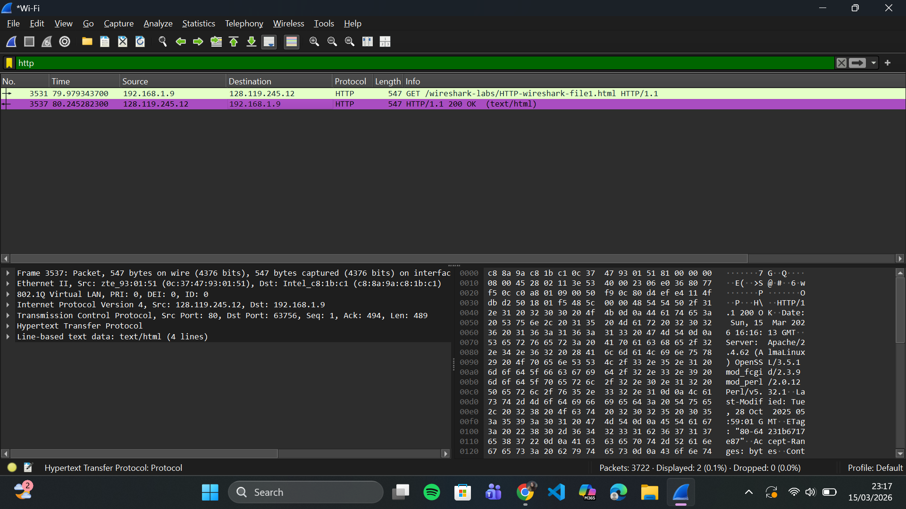
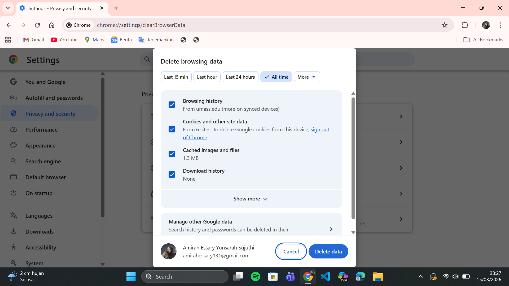
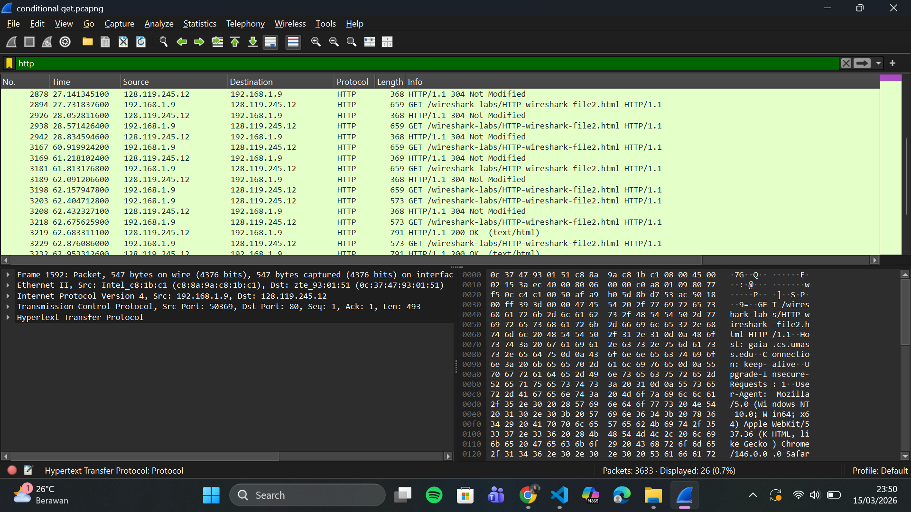
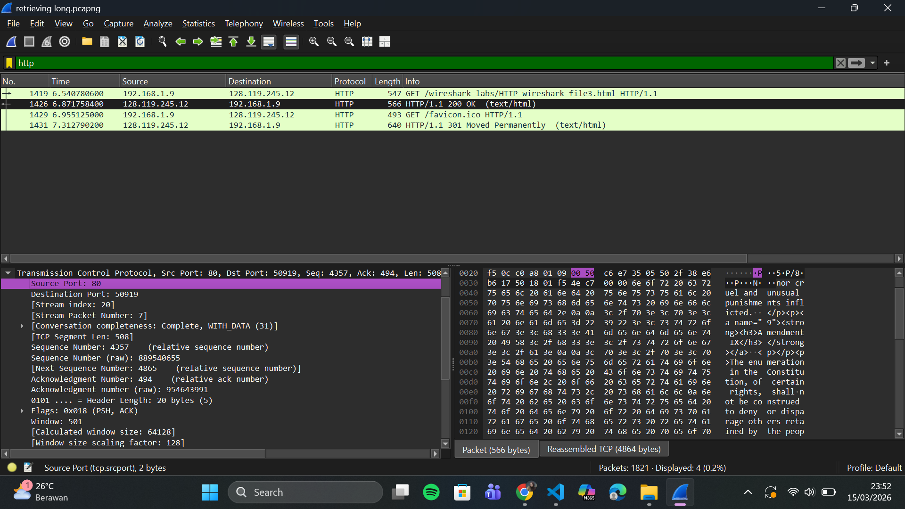
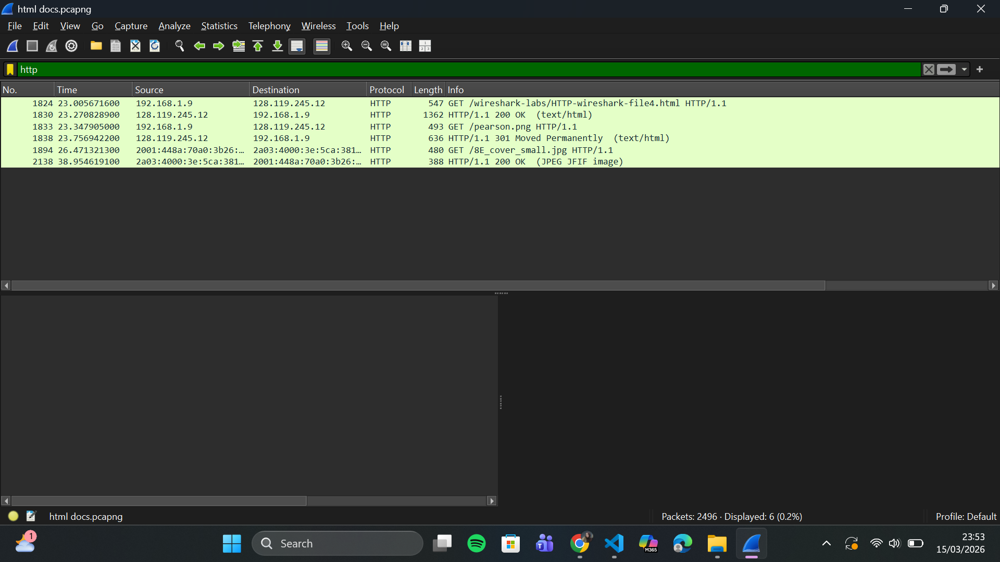
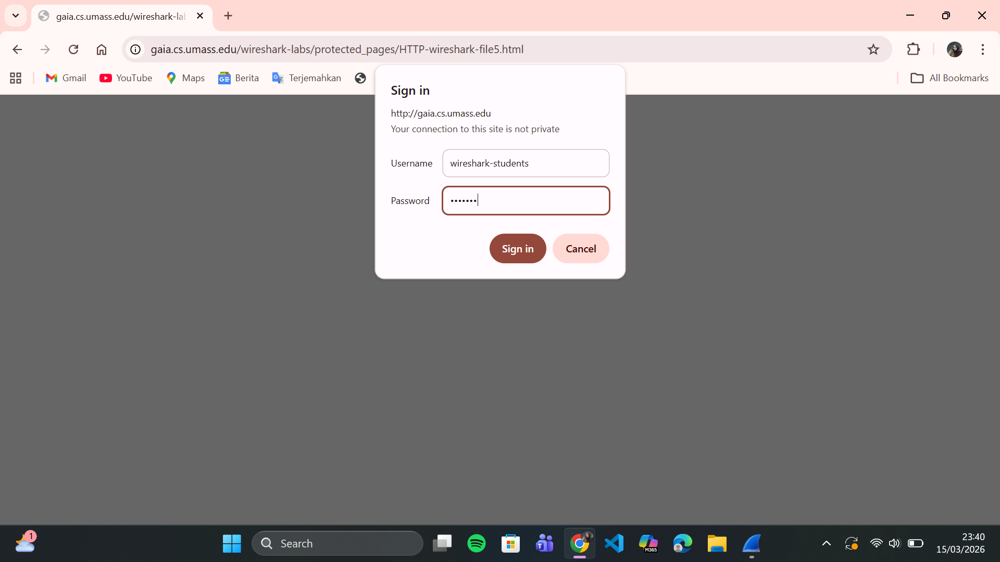
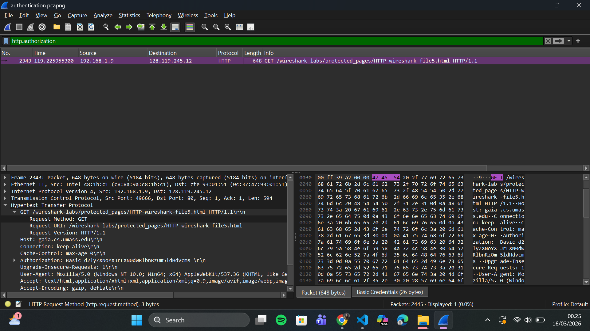

# LAPORAN PRAKTIKUM MODUL 3 : HTTP

## Tujuan Praktikum
1. Mengetahui cara kerja protokol HTTP menggunakan Wireshark.
2. Mengamati proses request dan response antara client dan server.
3. Memahami bagaimana browser mengambil halaman web beserta objek yang ada di dalamnya.

## Alat dan Bahan
- Wireshark
- Browser
- Koneksi internet

## Langkah Percobaan

### 1. Basic HTTP GET / Response
1. Membuka aplikasi Wireshark.
2. Menjalankan capture paket pada interface jaringan yang digunakan.
3. Pada kolom filter mengetik `http`.
4. Membuka browser dan mengakses:

```
http://gaia.cs.umass.edu/wireshark-labs/HTTP-wireshark-file1.html
```

5. Setelah halaman terbuka, menghentikan proses capture pada Wireshark.

### 2. HTTP Conditional GET
1. Membersihkan cache dan history pada browser.
2. Menjalankan Wireshark dan mulai capture paket.
3. Mengakses halaman berikut:

```
http://gaia.cs.umass.edu/wireshark-labs/HTTP-wireshark-file2.html
```

4. Melakukan refresh halaman beberapa kali.
5. Menghentikan capture paket.

### 3. Retrieving Long Documents
1. Membersihkan cache browser.
2. Menjalankan Wireshark dan mulai capture paket.
3. Mengakses halaman berikut:

```
http://gaia.cs.umass.edu/wireshark-labs/HTTP-wireshark-file3.html
```

4. Setelah halaman terbuka, menghentikan capture paket.

### 4. HTML dengan Embedded Objects
1. Menjalankan Wireshark dan mulai capture paket.
2. Membuka halaman berikut:

```
http://gaia.cs.umass.edu/wireshark-labs/HTTP-wireshark-file4.html
```

3. Halaman tersebut menampilkan HTML dengan beberapa gambar.
4. Menghentikan proses capture pada Wireshark.

### 5. HTTP Authentication
1. Menjalankan Wireshark dan mulai capture paket.
2. Mengakses halaman berikut:

```
http://gaia.cs.umass.edu/wireshark-labs/protected_pages/HTTP-wireshark-file5.html
```

3. Ketika diminta login, masukkan:

Username : wireshark-students  
Password : network  

4. Setelah halaman berhasil dibuka, hentikan capture paket.

## Hasil dan Pembahasan

### 1. Basic HTTP GET / Response

#### Tampilan Halaman Web


Halaman ini merupakan halaman HTML sederhana yang berhasil diakses melalui browser.

#### Hasil Capture Wireshark


Pada hasil capture Wireshark terlihat bahwa browser mengirimkan request **HTTP GET** ke server `gaia.cs.umass.edu`. Server kemudian memberikan respon **HTTP/1.1 200 OK** yang menandakan bahwa permintaan berhasil diproses.

### 2. HTTP Conditional GET

#### Menghapus Cache Browser


Sebelum melakukan percobaan Conditional GET, cache pada browser dibersihkan terlebih dahulu agar browser mengirim permintaan HTTP kembali ke server.

#### Tampilan Halaman Web


Halaman ini menampilkan teks sederhana setelah file berhasil diakses dari server.

#### Hasil Capture Wireshark


Pada Wireshark terlihat bahwa browser mengirim request HTTP kembali ke server. Server kemudian memberikan respon **304 Not Modified** yang berarti file tidak berubah sehingga browser dapat menggunakan file yang tersimpan di cache.

### 3. Retrieving Long Documents

#### Tampilan Halaman Web


Halaman ini menampilkan dokumen HTML yang cukup panjang yaitu teks mengenai **Bill of Rights**.

#### Hasil Capture Wireshark


Pada Wireshark terlihat bahwa respon HTTP dari server dikirim dalam beberapa paket TCP karena ukuran file HTML cukup besar sehingga tidak dapat dikirim dalam satu paket saja.

### 4. HTML Documents dengan Embedded Objects

#### Tampilan Halaman Web


Halaman ini merupakan file HTML yang memiliki objek tambahan berupa gambar yang disimpan pada server lain.

#### Hasil Capture Wireshark


Pada Wireshark terlihat beberapa request **HTTP GET** yang dikirim oleh browser untuk mengambil file HTML serta gambar yang terdapat pada halaman tersebut. Hal ini menunjukkan bahwa setiap objek pada halaman web diambil secara terpisah oleh browser.

### 5. HTTP Authentication

#### Tampilan Login


Pada halaman ini pengguna diminta memasukkan username dan password sebelum halaman dapat diakses. Proses ini merupakan mekanisme autentikasi untuk memastikan bahwa hanya pengguna yang memiliki kredensial yang dapat mengakses halaman tersebut.

#### Hasil Capture Wireshark


Pada hasil capture Wireshark digunakan filter `http.authorization` untuk menampilkan paket yang mengandung header autentikasi. Terlihat adanya header **Authorization: Basic** yang berisi username dan password dalam bentuk **Base64**.

Data tersebut merupakan hasil encoding dari **wireshark-students:network**. Meskipun terlihat seperti terenkripsi, sebenarnya data ini masih dapat dikembalikan ke bentuk aslinya sehingga metode ini kurang aman jika tidak menggunakan protokol tambahan seperti **HTTPS**.

## Kesimpulan

Berdasarkan praktikum yang telah dilakukan dapat diketahui bahwa protokol **HTTP** digunakan untuk komunikasi antara client dan server dalam mengakses halaman web. Dengan menggunakan **Wireshark**, kita dapat melihat proses pertukaran paket HTTP seperti request GET, respon dari server, conditional GET, pengambilan dokumen HTML berukuran besar, pengambilan objek tambahan pada halaman web, serta proses autentikasi HTTP.