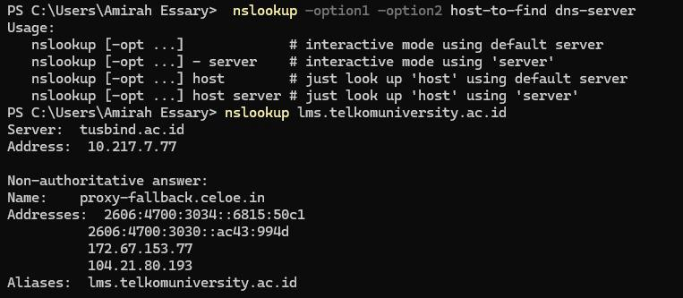
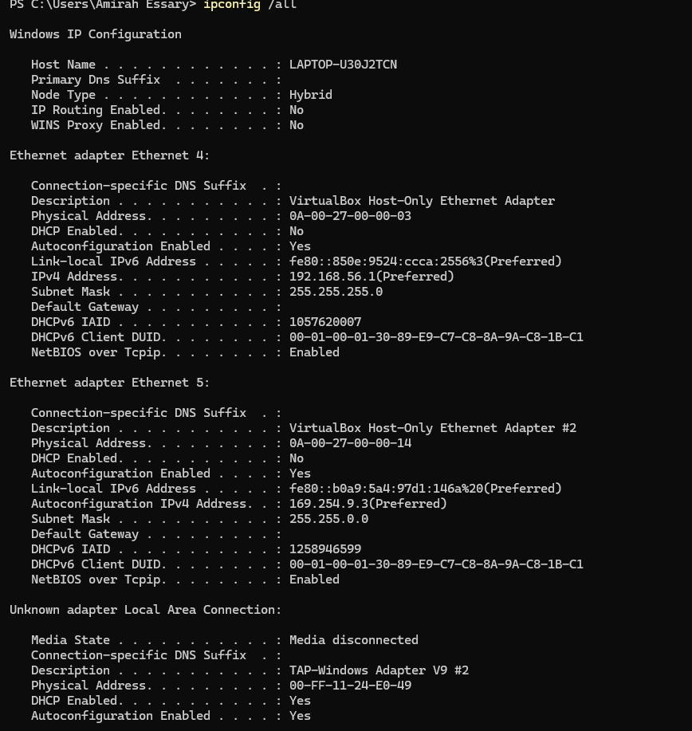
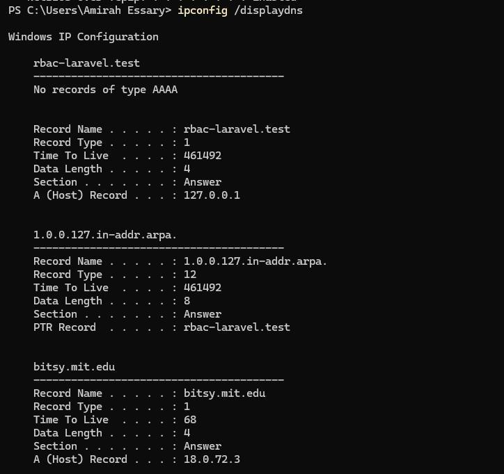
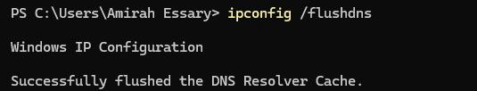

# LAPORAN PRAKTIKUM MODUL 4 : DNS

## Tujuan Praktikum
1. Mengetahui cara kerja DNS menggunakan Wireshark.
2. Memahami proses translasi nama domain menjadi alamat IP.
3. Menggunakan nslookup dan ipconfig untuk analisis DNS.
4. Mengamati proses DNS request dan DNS response pada jaringan.

---

## Alat dan Bahan
- Wireshark
- Browser
- Command Prompt / PowerShell
- Koneksi internet

---

# 4.2 NSLOOKUP

Pada modul ini digunakan perintah `nslookup` yang tersedia pada sistem operasi Windows maupun Linux/Unix untuk memperoleh informasi DNS dari suatu domain. Perintah `nslookup` memungkinkan host mengirim permintaan DNS ke server DNS tertentu dan menerima jawaban berupa alamat IP, mail server, maupun authoritative name server.

Untuk menjalankan `nslookup` pada Windows digunakan Command Prompt atau PowerShell, sedangkan pada Linux/Unix digunakan Terminal.

Sintaks umum perintah `nslookup` adalah:

```bash
nslookup -option host-to-find dns-server
```

Jika parameter `dns-server` tidak ditentukan, maka permintaan akan dikirim ke default DNS server lokal.

---

## 1. Nslookup Dasar

```bash
nslookup www.mit.edu
```

Hasil:


Pembahasan:

Pada hasil command prompt terlihat bahwa domain `www.mit.edu` berhasil diterjemahkan menjadi alamat IP oleh DNS server.

---

## 2. Menampilkan DNS Authoritative Server

```bash
nslookup -type=NS ox.ac.uk
```

Hasil:


Pembahasan:

Record NS digunakan untuk mengetahui DNS server yang bertanggung jawab terhadap suatu domain.

---

## 3. Menampilkan Mail Server Domain

```bash
nslookup -type=MX ox.ac.uk
```

Hasil:


Pembahasan:

Record MX digunakan untuk mengetahui server email yang menangani pengiriman dan penerimaan email pada suatu domain.

---

## 4. Pengujian Query Type Tidak Valid

```bash
nslookup -type=NX ox.ac.uk
```

Hasil:


Pembahasan:

Query type `NX` tidak valid pada `nslookup` sehingga sistem menampilkan pesan error.

---

## 5. Pengujian Nslookup Domain Telkom University

```bash
nslookup lms.telkomuniversity.ac.id
```

Hasil:



Pembahasan:

Domain Telkom University berhasil diterjemahkan menjadi beberapa alamat IPv4 dan IPv6.

---

## 6. Nslookup Menggunakan DNS Server Tertentu

```bash
nslookup www.aiit.or.kr bitsy.mit.edu
```

Hasil:


Pembahasan:

DNS request dikirim langsung menuju server DNS `bitsy.mit.edu`.

---

# 4.3 IPCONFIG

`Ipconfig` digunakan untuk menampilkan dan mengelola konfigurasi jaringan TCP/IP pada host.

---

## 1. Menampilkan Konfigurasi IP Dasar

```bash
ipconfig
```

Hasil:


Pembahasan:

Perintah `ipconfig` digunakan untuk menampilkan konfigurasi IP dasar host.

---

## 2. Menampilkan Seluruh Konfigurasi Jaringan

```bash
ipconfig /all
```

Hasil:



Pembahasan:

Perintah `ipconfig /all` digunakan untuk menampilkan seluruh konfigurasi jaringan secara lengkap.

---

## 3. Menampilkan DNS Cache

```bash
ipconfig /displaydns
```

Hasil:



Pembahasan:

Perintah `ipconfig /displaydns` digunakan untuk menampilkan DNS cache yang tersimpan pada host.

---

## 4. Menghapus DNS Cache

```bash
ipconfig /flushdns
```

Hasil:



Pembahasan:

Perintah `ipconfig /flushdns` digunakan untuk menghapus DNS cache pada host.

---

# 4.4 TRACING DNS DENGAN WIRESHARK

Pada bagian ini dilakukan analisis paket DNS menggunakan Wireshark.

---

## 1. Membersihkan DNS Cache

```bash
ipconfig /flushdns
```

Hasil:


---

## 2. Menjalankan Wireshark dan Mengatur Filter

```text
ip.addr == [IP address]
```

Pembahasan:

Filter digunakan agar hanya paket dari host yang ditampilkan.

---

## 3. Mengakses Website

```text
http://www.ietf.org
```

---

## 4. Menampilkan Paket DNS

```text
dns
```

Hasil:


Pembahasan:

Filter `dns` digunakan untuk menampilkan paket DNS request dan DNS response.

---

## 5. Capture Nslookup www.mit.edu

```bash
nslookup www.mit.edu
```

Hasil:


Pembahasan:

Wireshark menangkap DNS request dan DNS response domain `www.mit.edu`.

---

## 6. Capture Nslookup Type NS

```bash
nslookup -type=NS mit.edu
```

Hasil:


Pembahasan:

Query type NS digunakan untuk meminta authoritative name server domain `mit.edu`.

---

## 7. Capture Nslookup Menggunakan DNS Server Tertentu

```bash
nslookup www.aiit.or.kr bitsy.mit.edu
```

Hasil:


Pembahasan:

DNS request dikirim langsung menuju server `bitsy.mit.edu`.

---

# Analisa 4.4.1

## 1. Apakah DNS menggunakan UDP atau TCP?

DNS menggunakan protokol UDP, terlihat pada detail paket Wireshark yaitu:

```text
User Datagram Protocol (UDP)
```

---

## 2. Apa port tujuan dan port sumber DNS?

- Port tujuan DNS request adalah `53`
- Port sumber menggunakan port random, contohnya:
  - `51329`
  - `64607`

---

## 3. Apa alamat IP tujuan DNS?

Alamat IP tujuan DNS adalah:

```text
192.168.18.1
```

Alamat DNS lokal berdasarkan hasil `ipconfig` juga:

```text
192.168.18.1
```

Kesimpulan:

Alamat IP tujuan DNS sama dengan DNS server lokal sehingga request dikirim menuju DNS server lokal host.

---

## 4. Apa type DNS request?

Type DNS request yang digunakan adalah:

- A (IPv4)
- AAAA (IPv6)

Apakah request memiliki answer?

Tidak ada, karena paket tersebut hanya berupa query atau permintaan informasi domain.

---

## 5. Apa isi DNS response?

DNS response memiliki beberapa jawaban, yaitu:

- A Record : `104.16.45.99`
- A Record : `104.16.44.99`
- AAAA Record : `2606:4700:6810:...`

Kesimpulan:

DNS response berisi beberapa alamat IP domain yang diminta.

---

## 6. Apakah alamat IP pada TCP SYN sesuai dengan DNS response?

Ya, sesuai.

Setelah menerima DNS response, host mengirim paket TCP SYN menuju alamat IP hasil DNS tersebut.

---

## 7. Apakah host perlu mengirim DNS request baru setiap kali mengakses gambar?

Tidak perlu.

Host dapat menggunakan DNS cache sehingga alamat IP yang sudah diperoleh sebelumnya dapat digunakan kembali tanpa melakukan DNS request baru.

---

# Analisa 4.4.2

## 1. Apa port tujuan dan port sumber DNS?

- Port tujuan DNS request adalah `53`
- Port sumber pada balasan DNS berasal dari port `53`

---

## 2. Apa alamat IP tujuan DNS?

Pesan DNS request dikirim menuju:

```text
fe80::1
```

Kesimpulan:

Alamat tersebut merupakan default DNS server lokal host.

---

## 3. Apa type DNS request?

Type DNS request yang digunakan adalah:

- A (IPv4)
- AAAA (IPv6)

Apakah request memiliki answer?

Tidak ada, karena paket tersebut hanya berupa query.

---

## 4. Apa isi DNS response?

DNS response memiliki beberapa jawaban, yaitu:

- CNAME : `www.mit.edu.edgekey.net`
- CNAME : `e9566.dscb.akamaiedge.net`
- A / AAAA Record : alamat IP server tujuan

Kesimpulan:

DNS response berisi beberapa record seperti CNAME dan alamat IP domain tujuan.

---

## 5. Hasil tangkapan layar


---

# Analisa 4.4.3

## 1. Apa alamat IP tujuan DNS?

Pesan DNS request dikirim menuju:

```text
fe80::1
```

Kesimpulan:

Alamat tersebut merupakan default DNS server lokal host.

---

## 2. Apa type DNS request?

Type DNS request yang digunakan adalah:

- NS (Name Server)

Apakah request memiliki answer?

Tidak ada, karena paket tersebut hanya berupa query.

---

## 3. Apa isi DNS response?

DNS response berisi beberapa authoritative name server MIT, seperti:

- `use5.akam.net`
- `eur5.akam.net`

dan beberapa server Akamai lainnya.

Response juga menyertakan alamat IP dari server tersebut.

Kesimpulan:

DNS response berisi daftar Name Server (NS) beserta alamat IP servernya.

---

## 4. Hasil tangkapan layar


---

# Analisa 4.4.4

## 1. Apa alamat IP tujuan DNS?

Pesan DNS request dikirim menuju:

```text
bitsy.mit.edu
```

Kesimpulan:

Alamat tersebut bukan default DNS server lokal karena server DNS ditentukan secara manual pada perintah `nslookup`.

---

## 2. Apa type DNS request?

Type DNS request yang digunakan adalah:

- A (IPv4)

Apakah request memiliki answer?

Tidak ada, karena paket tersebut hanya berupa query.

---

## 3. Apa isi DNS response?

DNS response memiliki beberapa jawaban berupa:

- A Record
- Alamat IP domain `www.aiit.or.kr`

Kesimpulan:

DNS response berisi alamat IP domain yang diminta oleh host.

---

## 4. Hasil tangkapan layar


---

# Kesimpulan

Berdasarkan praktikum yang telah dilakukan dapat diketahui bahwa DNS berfungsi untuk menerjemahkan nama domain menjadi alamat IP agar dapat dikenali oleh host dalam jaringan.

Melalui Wireshark dapat diamati proses DNS request dan DNS response secara langsung. Hasil pengamatan menunjukkan bahwa komunikasi DNS umumnya menggunakan protokol UDP dengan port 53.

Selain itu, DNS response dapat berisi berbagai jenis record seperti A Record, AAAA Record, CNAME, dan NS Record. Praktikum ini juga menunjukkan bahwa host dapat menggunakan DNS cache sehingga tidak perlu selalu melakukan DNS request baru saat mengakses resource pada website.
````

