# LAPORAN PRAKTIKUM MODUL 6 : TCP

## Tujuan Praktikum
1. Mahasiswa dapat menginvestigasi cara kerja protokol TCP menggunakan Wireshark.

---

# 6.1 Pengantar

Pada modul ini dilakukan pengamatan terhadap protokol TCP (*Transmission Control Protocol*) menggunakan aplikasi Wireshark. TCP merupakan protokol transport yang menggunakan mekanisme *Three Way Handshake* untuk membangun koneksi serta memiliki *sequence number* dan *acknowledgement* untuk memastikan proses pengiriman data berjalan dengan baik.

Praktikum dilakukan dengan menangkap proses transfer file dari komputer klien menuju server menggunakan metode HTTP POST, kemudian menganalisis paket TCP yang dikirim dan diterima selama proses berlangsung.

---

# 6.2 Alat dan Bahan

- Wireshark  
- Browser  
- File `alice.txt`  
- Koneksi Internet  

---

# 6.3 Langkah Percobaan

1. Mengunduh file `alice.txt` dari website yang disediakan pada modul.
2. Membuka website upload file TCP Wireshark.
3. Menjalankan Wireshark dan memulai proses *capture packet*.
4. Mengunggah file `alice.txt` ke server.
5. Menghentikan proses capture setelah file berhasil diunggah.
6. Menggunakan filter `tcp` pada Wireshark.
7. Menganalisis paket TCP yang tertangkap.

---

# 6.4 Menangkap Transfer TCP dalam Jumlah Besar dari Komputer Pribadi ke Remote Server

## 1. Mengunduh file `alice.txt`

File `alice.txt` diunduh dari website yang telah disediakan pada modul.

---

## 2. Membuka website upload file TCP Wireshark

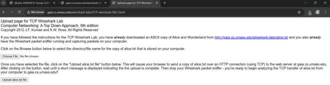

Kemudian mengupload file yang telah diunduh sebelumnya. Sebelum mengupload file, Wireshark harus dijalankan terlebih dahulu.

---

## 3. Menjalankan Wireshark dan memulai capture

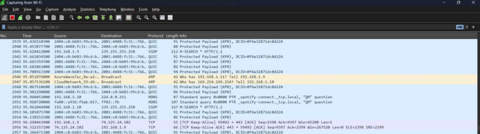

Wireshark dijalankan dan mulai melakukan proses *capture* jaringan.

---

## 4. File berhasil diupload

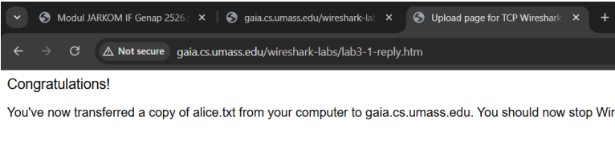

Setelah file berhasil diupload maka website akan menampilkan pesan bahwa file berhasil dikirim ke server.

---

## 5. Filter TCP pada Wireshark

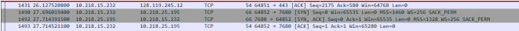

Kemudian proses capture dihentikan dan dilakukan filtering menggunakan keyword:

```text
tcp
```

Filtering dilakukan agar hanya paket TCP saja yang tampil sehingga mempermudah proses analisis paket.

---

# 6.3 Tampilan Awal pada Captured Trace

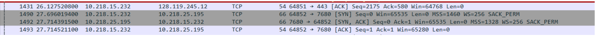

Berdasarkan hasil capture didapatkan bahwa terdapat berbagai jenis paket TCP seperti:

- ACK
- SYN
- SYN-ACK

Paket-paket tersebut menunjukkan proses *Three Way Handshake* yang digunakan TCP untuk membangun koneksi sebelum pengiriman data dilakukan.

---

# 6.4 Dasar TCP

## 1. Berapa nomor urut segmen TCP SYN yang digunakan untuk memulai sambungan TCP antara komputer klien dan gaia.cs.umass.edu?

### Jawaban

Didapatkan bahwa nomor urut (*sequence number*) awal yang digunakan saat memulai koneksi TCP adalah:

```text
0 (relative)
```

Segmen tersebut dikenali sebagai SYN karena:

```text
SYN = 1
ACK = 0
```

---

## 2. Berapa nomor urut segmen SYNACK yang dikirim oleh server?

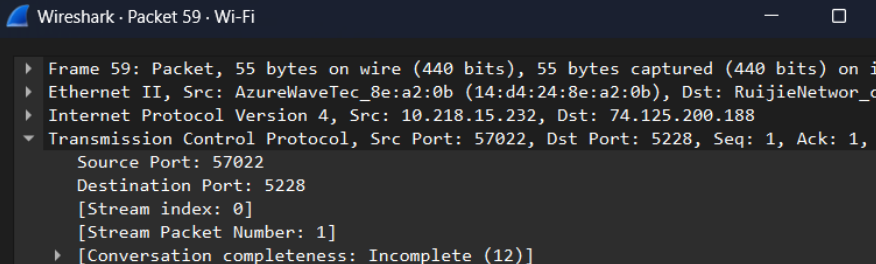

### Jawaban

Didapatkan bahwa server merespons menggunakan SYN-ACK yang memiliki:

```text
Sequence Number = 0
Acknowledgement = 1
```

Nilai ACK diperoleh dari:

```text
Sequence Number Client + 1
```

Segmen dikenali sebagai SYN-ACK karena flag SYN dan ACK aktif secara bersamaan.

---

## 3. Berapa nomor urut segmen TCP yang berisi perintah HTTP POST?

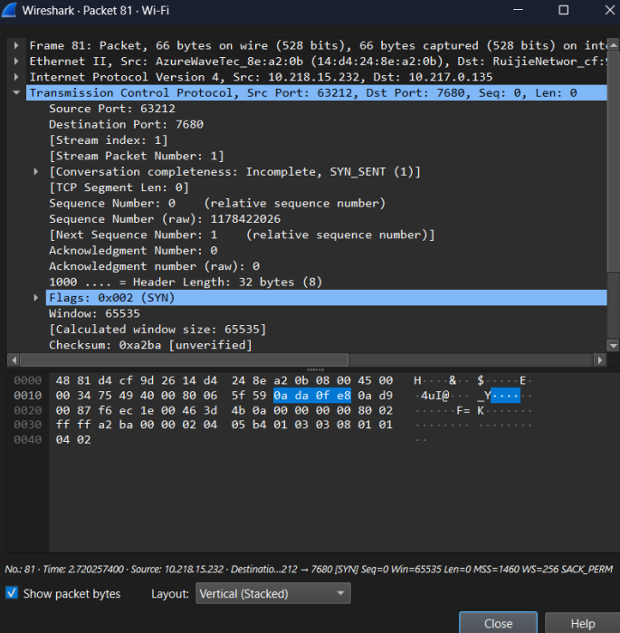

### Jawaban

Segmen TCP yang berisi HTTP POST ditemukan pada proses upload file menuju server menggunakan metode POST.

---

## 4. RTT dan Estimated RTT

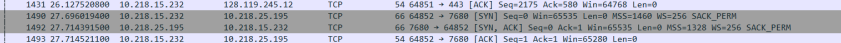

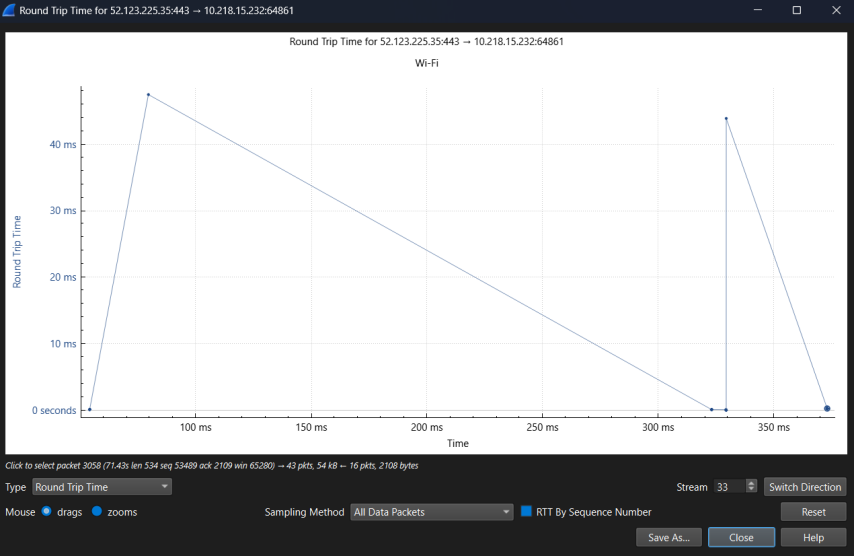
### Jawaban

RTT (*Round Trip Time*) merupakan waktu yang dibutuhkan paket untuk dikirim hingga ACK diterima kembali.

Dari grafik RTT terlihat adanya perbedaan waktu antara pengiriman paket dan penerimaan ACK pada beberapa segmen TCP.

---

## 5. Berapa panjang setiap enam segmen TCP pertama?

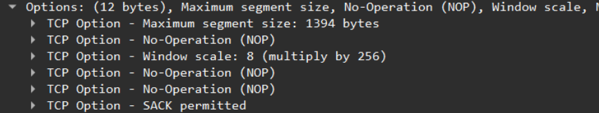

### Jawaban

Didapatkan panjang setiap enam segmen TCP pertama sebesar:

```text
1440 byte
```

---

## 6. Berapa jumlah minimum ruang buffer yang tersedia?

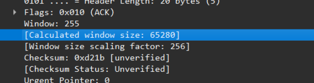

### Jawaban

Didapatkan:

```text
Window Size = 255
Calculated Window Size = 65280
```

Hal tersebut menunjukkan ruang buffer yang tersedia pada komunikasi TCP.

---

## 7. Apakah ada segmen yang ditransmisikan ulang?

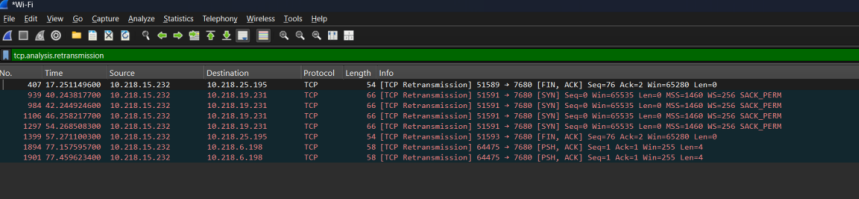

### Jawaban

Ada segmen yang mengalami retransmission.

Hal tersebut diketahui menggunakan filter:

```text
tcp.analysis.retransmission
```

Filter tersebut digunakan untuk menampilkan paket TCP yang dikirim ulang akibat ACK yang terlambat atau tidak diterima.

---

## 8. Berapa banyak data yang diakui oleh penerima dalam ACK?

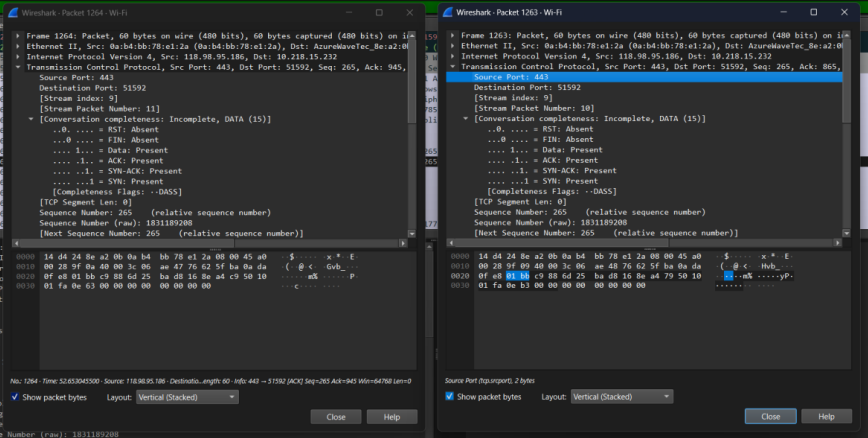

### Jawaban

Pada paket ACK didapatkan:

```text
Seq = 265
ACK = 865
```

Kemudian paket berikutnya:

```text
Seq = 265
ACK = 945
```

Hal tersebut menunjukkan adanya data yang berhasil diterima oleh pengirim.

---

## 9. Berapa throughput untuk sambungan TCP?

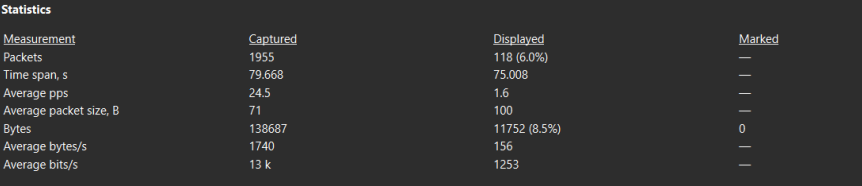

### Jawaban

Didapatkan throughput sebesar:

```text
13 kbps
```

atau sekitar:

```text
1740 byte/s
```

Rumus throughput:

```text
Throughput = Total data yang terkirim / total waktu
```

---

# 6.5 Congestion Control TCP

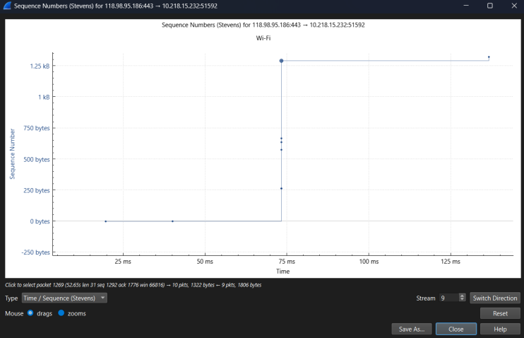

Congestion Control digunakan untuk mengetahui jumlah data yang dikirim pada satuan waktu dari client ke server.

Pada Wireshark, visualisasi dilakukan melalui:

```text
Statistics > TCP Stream Graph > Time Sequence (Stevens)
```

---

# 6.5.1 Soal Latihan

## Identifikasi fase Slow Start dan Congestion Avoidance

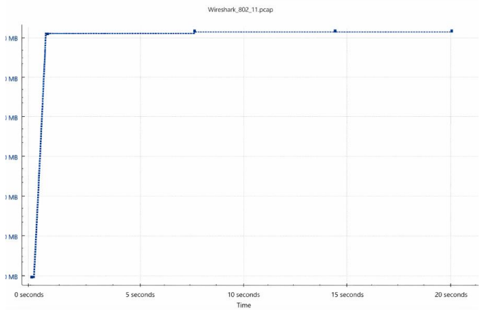

### Jawaban

### 1. Identifikasi Fase Slow Start

- Dimulai : sekitar detik 0.0
- Berakhir : sekitar detik 0.5 – 1.0

Pada fase ini TCP mulai mengirim data menggunakan *congestion window* kecil kemudian meningkat secara eksponensial setiap menerima ACK.

---

### 2. Identifikasi Fase Congestion Avoidance

- Dimulai : sekitar detik 0.5 – 1.0

Pada fase ini pertumbuhan pengiriman data berubah dari eksponensial menjadi linear untuk menghindari kemacetan jaringan.

---

# Kesimpulan

Berdasarkan hasil praktikum dapat disimpulkan bahwa TCP merupakan protokol yang menggunakan mekanisme koneksi dan pengendalian data yang lebih kompleks dibanding UDP.

Melalui Wireshark dapat diamati proses *Three Way Handshake*, penggunaan *sequence number*, *acknowledgement*, retransmission, throughput, RTT, dan mekanisme *congestion control* pada TCP.