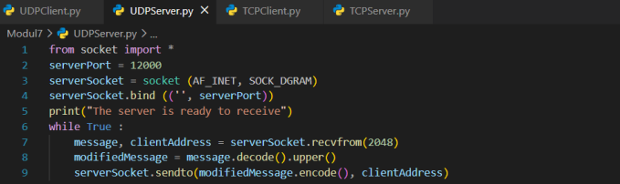
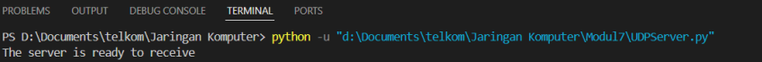
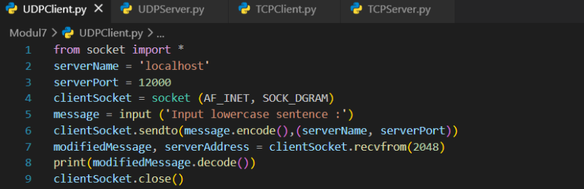
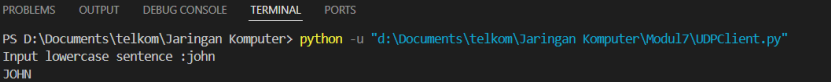
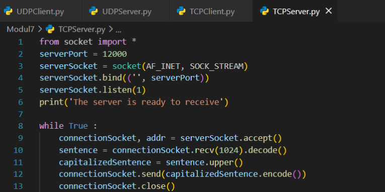
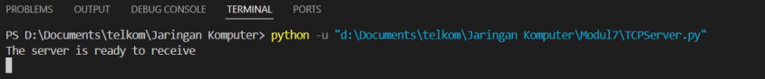
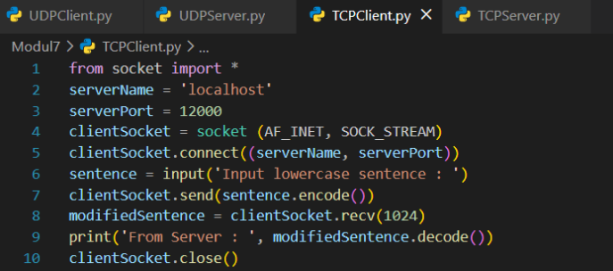
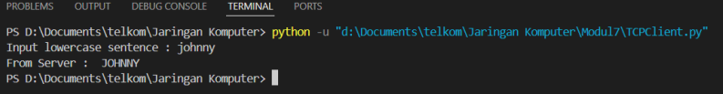

# LAPORAN PRAKTIKUM MODUL 7 : SOCKET PROGRAMMING

## Tujuan Praktikum
1. Mahasiswa dapat memahami implementasi socket programming menggunakan protokol TCP dan UDP.

---

# 7.1 Pengantar

Socket programming digunakan untuk membangun komunikasi antara client dan server pada jaringan komputer. Pada praktikum ini dilakukan implementasi socket programming menggunakan dua protokol transport yaitu TCP dan UDP.

TCP (*Transmission Control Protocol*) merupakan protokol yang bersifat reliable dan menggunakan koneksi sebelum pengiriman data dilakukan. Sedangkan UDP (*User Datagram Protocol*) bersifat connectionless sehingga proses pengiriman data lebih sederhana dan cepat.

---

# 7.2 Alat dan Bahan

- Laptop / Komputer  
- Python  
- Visual Studio Code  
- Terminal / Command Prompt  
- Koneksi Internet  
- Modul Socket Programming  

---

# 7.3 Perbedaan TCP dan UDP dalam Kode yang Telah Dibuat

## A. Inisialisasi Socket

- **TCP** menggunakan konstanta:

```python
SOCK_STREAM
```

TCP mengirim data sebagai aliran byte yang berurutan dan reliable.

- **UDP** menggunakan konstanta:

```python
SOCK_DGRAM
```

UDP tidak menjamin urutan maupun keberhasilan pengiriman data.

---

## B. Mekanisme Koneksi

- **TCP** membutuhkan proses *Three Way Handshake* sebelum data dikirimkan.

Pada sisi server terdapat:

```python
listen()
accept()
```

Sedangkan pada client terdapat:

```python
connect()
```

- **UDP** bersifat *connectionless* sehingga tidak membutuhkan proses handshake.

---

## C. Pengiriman dan Penerimaan Data

- **TCP** menggunakan:

```python
send()
recv()
```

- **UDP** menggunakan:

```python
sendto()
recvfrom()
```

Karena UDP tidak memiliki koneksi tetap maka alamat IP dan port tujuan harus selalu disertakan.

---

## D. Arsitektur Server

- **TCP** memiliki dua jenis socket:
  - Welcoming Socket
  - Connection Socket

- **UDP** hanya menggunakan satu socket untuk melayani seluruh client.

---

# 7.4 UDPServer.py

## Kode



## Output yang didapatkan



## Penjelasan Kode

### `from socket import *`

Digunakan untuk mengimpor modul socket.

---

### `serverPort = 12000`

Menentukan port server yang digunakan untuk menerima pesan dari client.

---

### `serverSocket = socket(AF_INET, SOCK_DGRAM)`

Digunakan untuk membuat socket server menggunakan IPv4 dan protokol UDP.

---

### `serverSocket.bind(('', serverPort))`

Digunakan untuk menghubungkan socket server ke port 12000 agar dapat menerima pesan dari client.

---

### `print("The server is ready to receive")`

Menampilkan pesan bahwa server siap menerima data.

---

### `while True`

Membuat server terus berjalan untuk menerima pesan dari client.

---

### `message, clientAddress = serverSocket.recvfrom(2048)`

Menerima pesan dari client dengan ukuran buffer 2048 byte dan menyimpan alamat client.

---

### `modifiedMessage = message.decode().upper()`

Mengubah pesan dari byte menjadi string kemudian mengubah seluruh huruf menjadi huruf besar.

---

### `serverSocket.sendto(modifiedMessage.encode(), clientAddress)`

Mengirim kembali pesan yang telah diubah ke client dalam bentuk byte.

---

# 7.5 UDPClient.py

## Kode



## Output yang didapatkan



## Penjelasan Kode

### `from socket import *`

Mengimpor modul socket.

---

### `serverName = 'localhost'`

Menentukan alamat server yang dituju.

---

### `serverPort = 12000`

Menentukan port server yang digunakan untuk komunikasi.

---

### `clientSocket = socket(AF_INET, SOCK_DGRAM)`

Membuat socket client menggunakan IPv4 dan protokol UDP.

---

### `message = input('Input lowercase sentence : ')`

Meminta user memasukkan pesan.

---

### `clientSocket.sendto(message.encode(), (serverName, serverPort))`

Mengubah pesan menjadi byte kemudian mengirimkannya ke server.

---

### `modifiedMessage, serverAddress = clientSocket.recvfrom(2048)`

Menerima balasan dari server.

---

### `print(modifiedMessage.decode())`

Menampilkan pesan balasan dari server.

---

### `clientSocket.close()`

Menutup socket dan mengakhiri program.

---

# 7.6 TCPServer.py

## Kode



## Output yang didapatkan



## Penjelasan Kode

### `from socket import *`

Mengimpor modul socket.

---

### `serverPort = 12000`

Menentukan port server untuk menerima koneksi client.

---

### `serverSocket = socket(AF_INET, SOCK_STREAM)`

Membuat socket server menggunakan IPv4 dan protokol TCP.

---

### `serverSocket.bind(('', serverPort))`

Menghubungkan socket server dengan port 12000.

---

### `serverSocket.listen(1)`

Membuat server mendengarkan koneksi masuk maksimal 1 client.

---

### `print('The server is ready to receive')`

Menampilkan pesan bahwa server siap menerima koneksi.

---

### `while True`

Membuat server terus berjalan.

---

### `connectionSocket, addr = serverSocket.accept()`

Menerima koneksi dari client dan menyimpan alamat client.

---

### `sentence = connectionSocket.recv(1024).decode()`

Menerima pesan dari client dan mengubahnya dari byte menjadi string.

---

### `capitalizedSentence = sentence.upper()`

Mengubah seluruh huruf menjadi huruf besar.

---

### `connectionSocket.send(capitalizedSentence.encode())`

Mengirim kembali pesan yang telah diubah ke client.

---

### `connectionSocket.close()`

Menutup koneksi dengan client.

---

# 7.7 TCPClient.py

## Kode



## Output yang didapatkan



## Penjelasan Kode

### `from socket import *`

Mengimpor modul socket.

---

### `serverName = 'localhost'`

Menentukan alamat server yang akan dihubungi.

---

### `serverPort = 12000`

Menentukan port server untuk komunikasi.

---

### `clientSocket = socket(AF_INET, SOCK_STREAM)`

Membuat socket client menggunakan IPv4 dan protokol TCP.

---

### `clientSocket.connect((serverName, serverPort))`

Menghubungkan client ke server menggunakan alamat dan port yang telah ditentukan.

---

### `sentence = input('Input lowercase sentence : ')`

Meminta user memasukkan pesan.

---

### `clientSocket.send(sentence.encode())`

Mengirim pesan ke server setelah diubah menjadi byte.

---

### `modifiedSentence = clientSocket.recv(1024)`

Menerima balasan dari server.

---

### `print('From Server : ', modifiedSentence.decode())`

Menampilkan pesan balasan dari server.

---

### `clientSocket.close()`

Menutup koneksi socket dan mengakhiri program.

---

# Kesimpulan

Berdasarkan hasil praktikum dapat disimpulkan bahwa socket programming memungkinkan komunikasi antara client dan server menggunakan protokol TCP maupun UDP.

TCP bersifat connection-oriented dan reliable karena menggunakan mekanisme handshake dan acknowledgement. Sedangkan UDP bersifat connectionless dan lebih ringan karena tidak membutuhkan koneksi sebelum pengiriman data dilakukan.