# LAPORAN PRAKTIKUM MODUL 9 : WEB SERVER

## Tujuan Praktikum
1. Mahasiswa dapat memahami implementasi web server sederhana menggunakan Python Socket Programming.

---

# 9.1 Pengantar

Pada modul ini dilakukan implementasi web server sederhana menggunakan bahasa pemrograman Python dan socket programming. Web server digunakan untuk menerima request dari client melalui browser kemudian mengirimkan halaman HTML sebagai response.

Selain itu dilakukan juga pengujian terhadap halaman yang tersedia maupun halaman yang tidak tersedia untuk melihat response `200 OK` dan `404 Not Found`.

---

# 9.2 Alat dan Bahan

- Laptop / Komputer  
- Python  
- Visual Studio Code  
- Browser  
- Terminal / Command Prompt  
- Modul Web Server  

---

# 9.3 Skeleton Kode Python untuk Web Server

## A. Web_server.py

### Kode

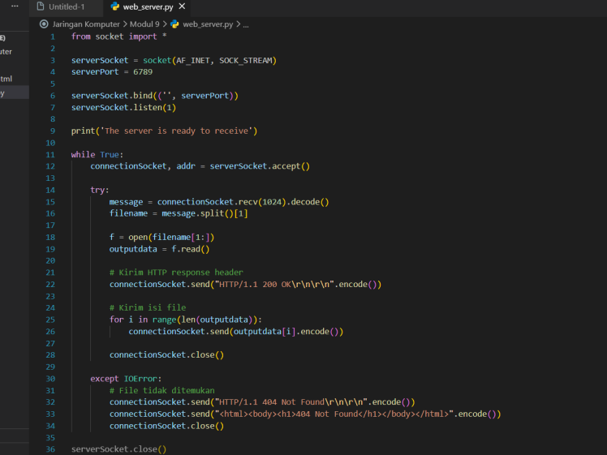

Kode diatas merupakan implementasi kode web server sederhana menggunakan Python Socket.

---

### Output yang didapatkan

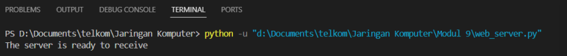

Jika muncul pesan:

```text
The server is ready to receive
```

maka server berhasil dijalankan dan siap digunakan.

---

## B. Web_server.html

### Kode

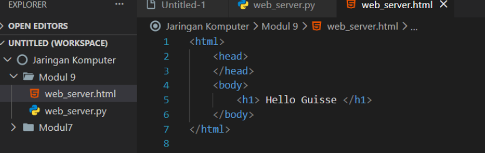

Kemudian membuka alamat URL berikut:

```text
http://localhost:6789/web_server.html
```

---

### Output Website

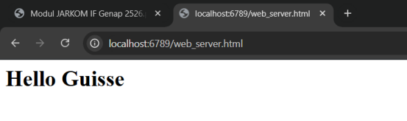

Saat website berhasil dipanggil maka browser akan menampilkan isi halaman HTML yang telah dibuat.

---

### Output 404 Not Found

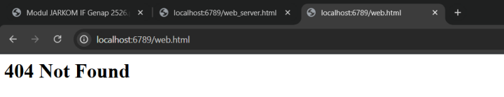

Ketika mencoba membuka halaman yang tidak tersedia menggunakan:

```text
http://localhost:6789/web.html
```

maka server akan menampilkan pesan:

```text
404 Not Found
```

---

# 9.4 Latihan Tambahan

## A. Server.py

### Kode

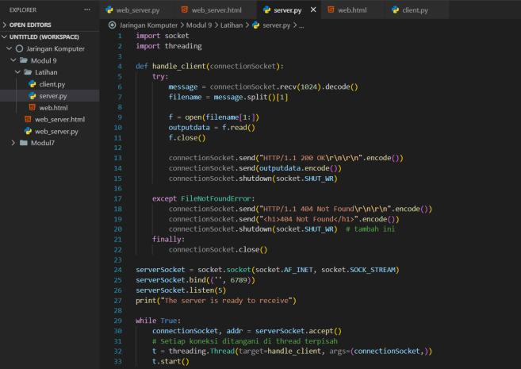

---

### Output yang didapatkan

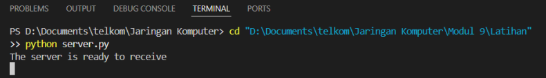

Jika muncul pesan:

```text
The server is ready to receive
```

maka server berhasil dijalankan.

---

## B. Client.py

### Kode

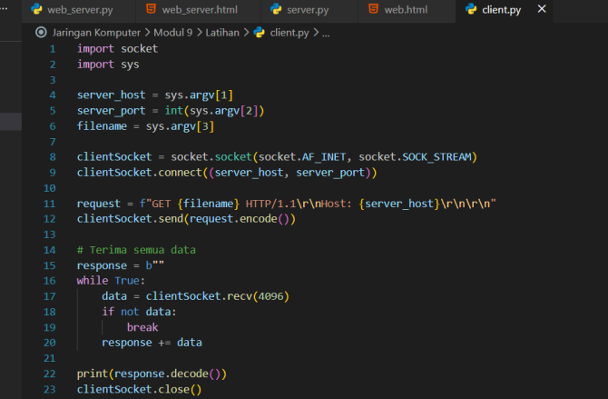

Pastikan seluruh file berada dalam folder yang sama agar program dapat berjalan dengan baik.

---

## C. Web.html

### Kode

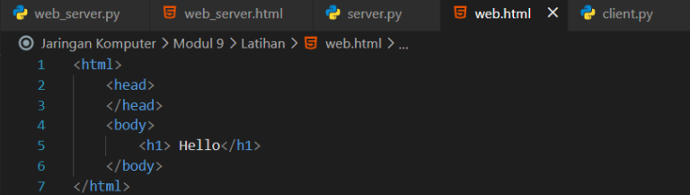

---

## D. Output

### Berhasil

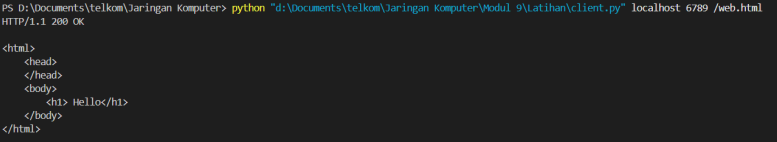

Saat website berhasil dipanggil maka akan menampilkan:

```text
200 OK
```

beserta isi halaman HTML yang diminta.

---

### Error

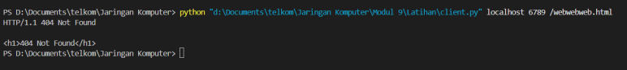

Pada percobaan kedua muncul pesan:

```text
404 Not Found
```

karena halaman website yang dipanggil tidak tersedia pada server.

---

# Kesimpulan

Berdasarkan hasil praktikum dapat disimpulkan bahwa web server sederhana dapat dibuat menggunakan Python Socket Programming.

Server mampu menerima request dari browser kemudian memberikan response berupa halaman HTML. Selain itu server juga dapat memberikan response error `404 Not Found` ketika halaman yang diminta tidak tersedia.