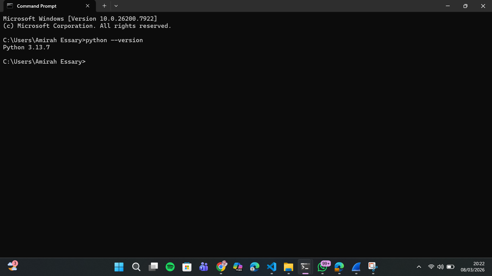

 # LAPORAN PRAKTIKUM MODUL 1 : RUNNING MODUL
 
 ## Tujuan Praktikum
 Mengetahui aturan praktikum dan memastikan tools (Wireshark & Python) berfungsi dengan baik.
 
 ## Alat dan Bahan
 - Wireshark (http://www.wireshark.org/)
 - Python (https://www.python.org/downloads/)
 
 ## Langkah Percobaan
 1. Download Wireshark di http://www.wireshark.org/ lalu install
 2. Download Python di https://www.python.org/downloads/ lalu install
 3. Verifikasi Python sudah terinstall lewat terminal:
 ```bash
 python --version
 ```
 
 ## Lampiran
 
  
 
 
  
 ## Kesimpulan 
 Wireshark dan Python berhasil terinstall dan berfungsi dengan baik di laptop, sehingga siap digunakan untuk praktikum jaringan komputer.