# LAPORAN PRAKTIKUM MODUL 10 : IP

## Tujuan Praktikum
1. Mahasiswa dapat memahami konsep Internet Protocol (IP).
2. Mahasiswa dapat melakukan analisis IPv4 dan IPv6 menggunakan Wireshark.

---

# 10.1 Pengantar

Internet Protocol (IP) merupakan aturan komunikasi yang digunakan dalam pertukaran data melalui jaringan internet. Pada praktikum ini dilakukan pengamatan terhadap IPv4 dan IPv6 menggunakan Wireshark.

Selain itu dilakukan juga pengujian menggunakan perintah `tracert` dan `ipconfig` untuk mengetahui jalur pengiriman paket serta informasi IP pada perangkat.

---

# 10.2 Alat dan Bahan

- Laptop / Komputer  
- Wireshark  
- Command Prompt  
- Koneksi Internet  
- Modul IP  

---

# 10.3 IP

IP atau Internet Protocol merupakan aturan komunikasi yang melakukan pertukaran data melalui internet.

IPv4 dan IPv6 memiliki perbedaan pada kapasitas alamat dan format keamanan.

- IPv4 memiliki format 32 bit dan dapat menampung sekitar 4 miliar alamat.
- IPv6 memiliki format 128 bit dan dapat menampung lebih dari:

```text
1 x 10^36 alamat
```

---

# 10.4 Tracert

Perintah `tracert` digunakan untuk menunjukkan rute yang dilewati paket untuk mencapai server tujuan.

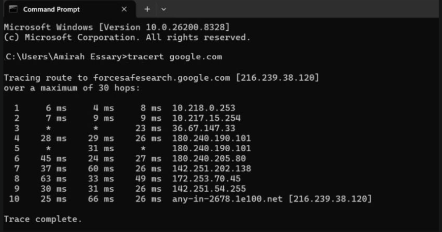

Pada hasil tracert terlihat beberapa hop yang dilewati paket sebelum mencapai server tujuan.

---

# 10.5 Ipconfig

Perintah `ipconfig` digunakan untuk menampilkan informasi dasar IP pada perangkat.

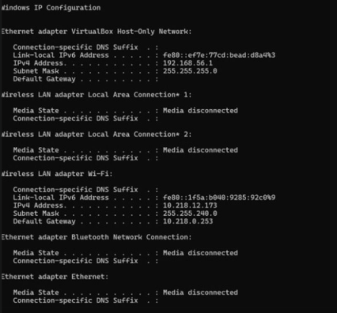

Informasi yang ditampilkan meliputi:

- IPv4 Address
- Subnet Mask
- Default Gateway

---

# 10.6 IPv4 Dasar

## a. Menjalankan Capture pada Wireshark

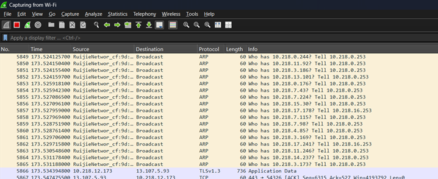

Capture dilakukan beberapa saat untuk mendapatkan paket jaringan.

---

## b. Melakukan Filter pada Wireshark

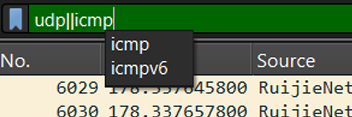

Filter dilakukan untuk menampilkan paket tertentu pada Wireshark.

---

## c. Double Klik Salah Satu Paket

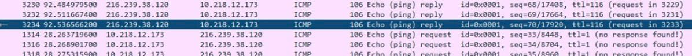

Salah satu paket dipilih untuk melihat detail informasi paket.

---

## d. Detail Internet Protocol Version 4

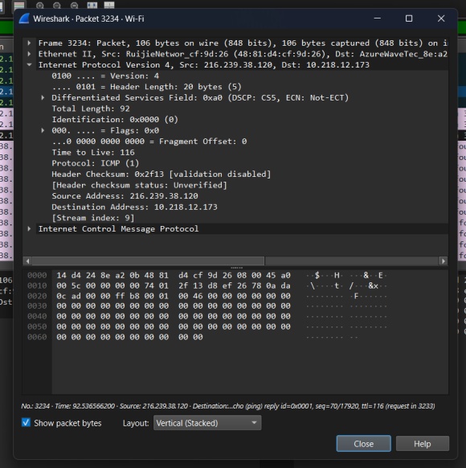

Pada detail paket terlihat informasi:

```text
Internet Protocol Version 4
```

yang menunjukkan bahwa paket menggunakan IPv4.

---

## e. Filter IPv4 dan ICMP

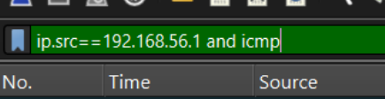

Dilakukan filter menggunakan alamat IPv4 dan protokol ICMP.

---

## f. Hasil Filter Paket

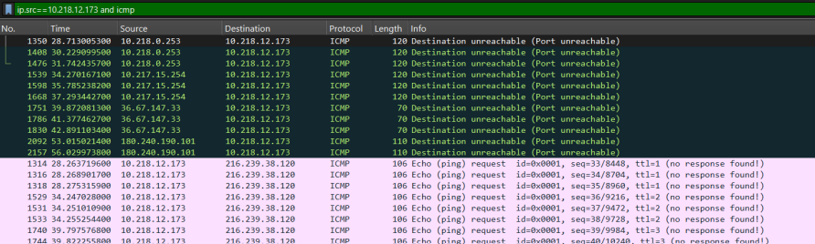

Wireshark menampilkan paket yang sesuai dengan filter yang diberikan.

---

## g. Informasi Internet Protocol Version 4

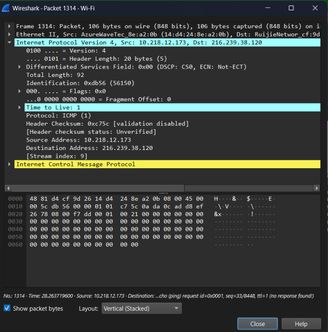

Pada detail paket terlihat informasi:

```text
Internet Protocol Version 4
```

yang menunjukkan bahwa Wireshark berhasil mendapatkan alamat IPv4 pada perangkat.

---

# 10.7 Fragmentasi

Fragmentasi merupakan proses pemecahan paket data menjadi bagian-bagian kecil agar dapat dikirim melalui MTU (*Maximum Transmission Unit*).

Sedangkan *reassembly* merupakan proses penyusunan kembali fragmen paket menjadi datagram IP utuh pada host tujuan.

---

## a. Sebelum Fragmentasi

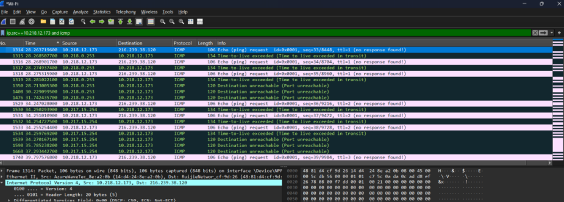

---

## b. Sesudah Fragmentasi

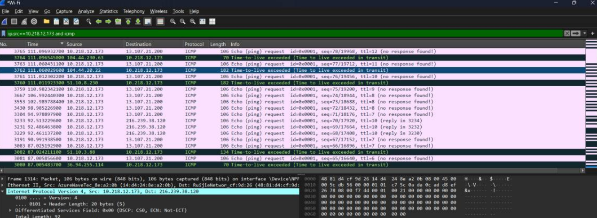

Pada hasil fragmentasi terlihat bahwa paket dipecah menjadi beberapa bagian agar dapat dikirimkan sesuai ukuran MTU jaringan.

---

# 10.8 IPv6

## a. Filter IPv6 pada Wireshark

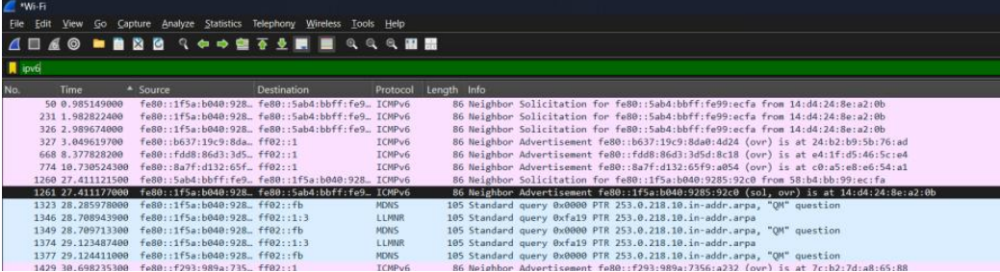

Dilakukan filter IPv6 untuk menampilkan paket yang menggunakan protokol IPv6.

---

## b. Detail Internet Protocol Version 6

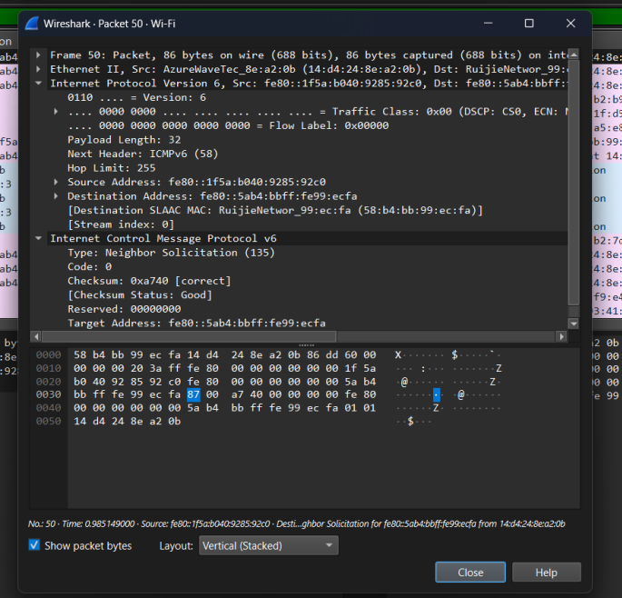

Pada detail paket terlihat informasi:

```text
Internet Protocol Version 6
```

yang menunjukkan bahwa paket menggunakan protokol IPv6.

---

# Kesimpulan

Berdasarkan hasil praktikum dapat disimpulkan bahwa Internet Protocol digunakan sebagai aturan komunikasi pada jaringan komputer.

IPv4 memiliki format 32 bit sedangkan IPv6 memiliki format 128 bit dengan kapasitas alamat yang jauh lebih besar.

Melalui Wireshark dapat dilakukan analisis paket IPv4 dan IPv6, termasuk proses fragmentasi, penggunaan protokol ICMP, serta pengamatan jalur paket menggunakan perintah tracert.