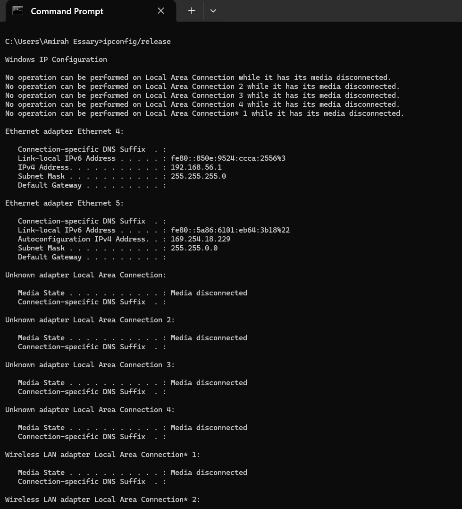
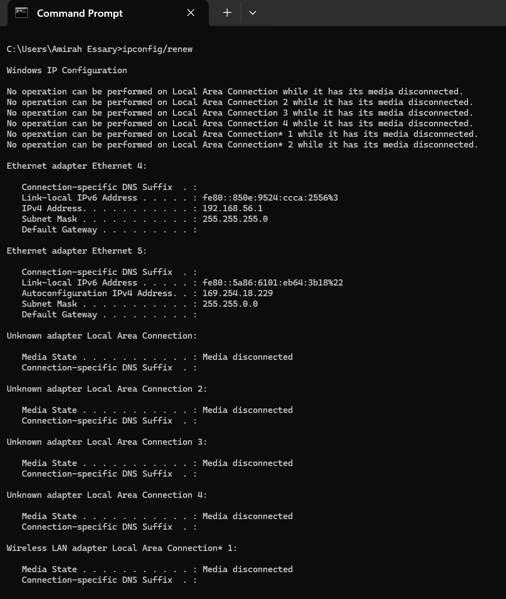
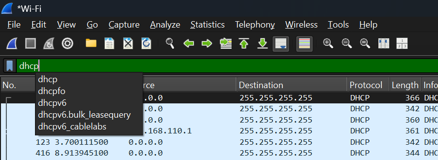
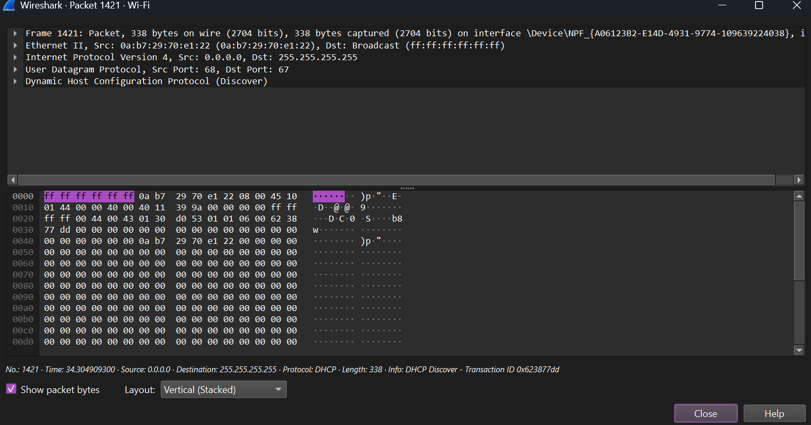
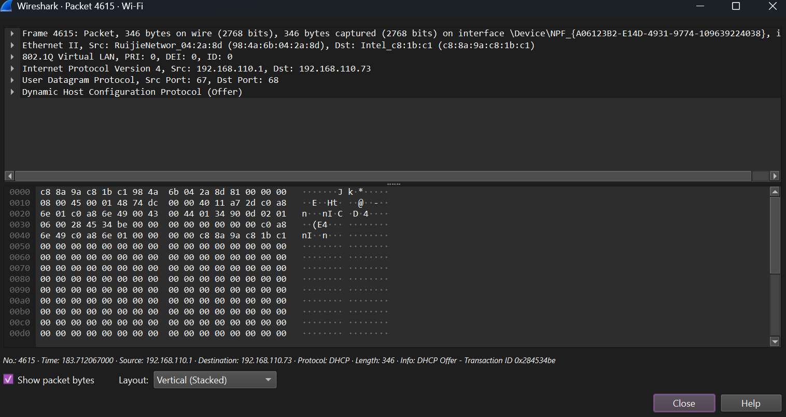
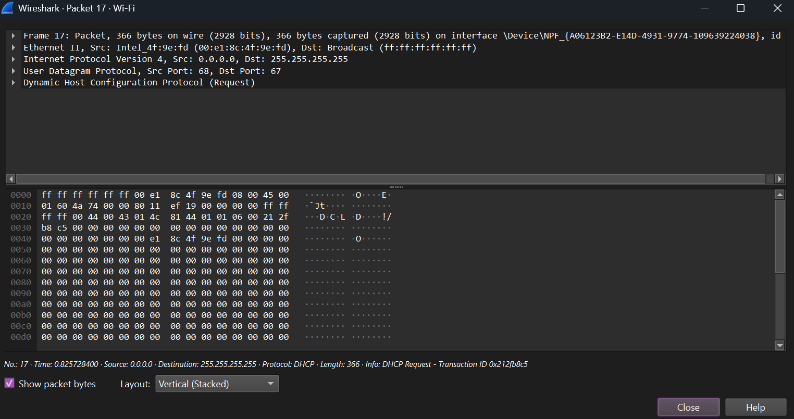
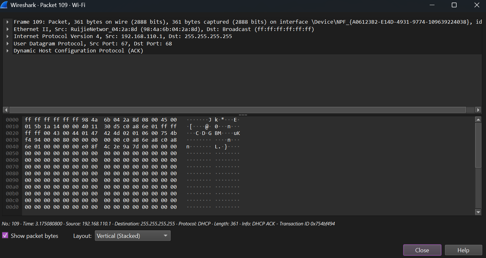
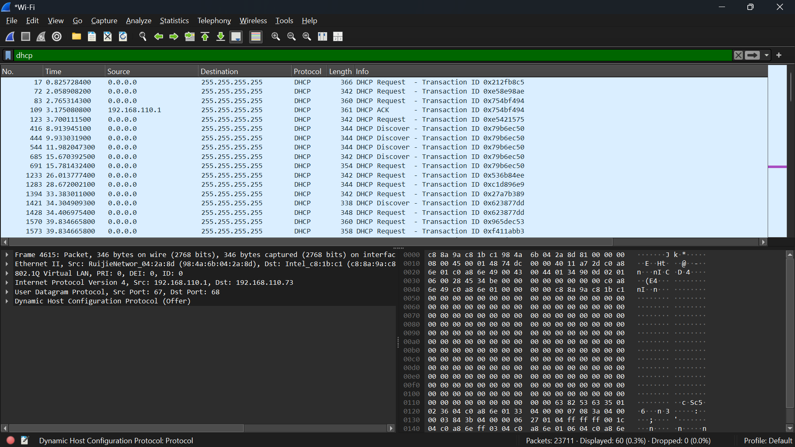

# LAPORAN PRAKTIKUM MODUL 11 : DHCP

## Tujuan Praktikum
1. Mahasiswa dapat menginvestigasi cara kerja protokol DHCP menggunakan Wireshark.

---

# 11.1 Pengantar

Pada modul ini dilakukan pengamatan terhadap protokol DHCP (*Dynamic Host Configuration Protocol*) menggunakan aplikasi Wireshark.

DHCP digunakan untuk memberikan alamat IP secara otomatis kepada host serta mengkonfigurasi informasi jaringan lainnya seperti subnet mask, gateway, dan DNS.

Melalui praktikum ini dilakukan proses capture paket DHCP untuk melihat komunikasi antara client dan server DHCP.

---

# 11.2 Alat dan Bahan

- Laptop / Komputer  
- Wireshark  
- Command Prompt / Terminal  
- Koneksi Internet  
- Modul DHCP  

---

# 11.3 Langkah Percobaan

## A. Membuka Wireshark

1. Buka aplikasi Wireshark.
2. Pilih interface jaringan yang sedang digunakan.
3. Klik tombol Start untuk memulai capture paket.

---

## B. Melakukan Release IP

### Pada Windows

1. Buka Command Prompt.
2. Ketik perintah berikut:

```bash
ipconfig /release
```

3. Tekan Enter.
4. Tunggu hingga alamat IP berhasil dilepaskan.



---

## C. Melakukan Renew IP

1. Pada Command Prompt ketik:

```bash
ipconfig /renew
```

2. Tekan Enter.
3. Tunggu beberapa saat hingga perangkat mendapatkan alamat IP baru dari DHCP Server.



---

## D. Menghentikan Capture Wireshark

1. Setelah proses renew selesai, kembali ke Wireshark.
2. Klik tombol Stop Capture.

---

## E. Melakukan Filter DHCP

1. Pada kolom filter Wireshark ketik:

```text
dhcp
```

2. Tekan Enter.
3. Wireshark akan menampilkan paket DHCP.



---

# 11.4 Analisis Paket DHCP

## A. DHCP Discover



### Penjelasan

DHCP Discover merupakan proses awal ketika client mencari DHCP Server yang tersedia pada jaringan.

Paket dikirim secara broadcast karena client belum mengetahui alamat server DHCP.

---

## B. DHCP Offer



### Penjelasan

DHCP Server memberikan penawaran alamat IP kepada client.

Paket ini berisi:
- IP Address
- Subnet Mask
- Gateway
- DNS

---

## C. DHCP Request



### Penjelasan

Client meminta alamat IP yang telah ditawarkan oleh DHCP Server.

Client juga memberi tahu server bahwa alamat IP tersebut akan digunakan.

---

## D. DHCP ACK



### Penjelasan

DHCP ACK merupakan konfirmasi dari server bahwa alamat IP berhasil diberikan kepada client.

Setelah proses ini selesai maka client dapat menggunakan jaringan.

---

# 11.5 Hasil Capture DHCP pada Wireshark



Pada hasil capture terlihat proses:
- DHCP Discover
- DHCP Offer
- DHCP Request
- DHCP ACK

yang menunjukkan komunikasi antara client dan server DHCP.

---

# 11.6 Kesimpulan

Berdasarkan hasil praktikum dapat disimpulkan bahwa DHCP merupakan protokol yang digunakan untuk memberikan alamat IP secara otomatis kepada perangkat pada jaringan komputer.

Melalui Wireshark dapat diamati proses komunikasi DHCP mulai dari Discover, Offer, Request, hingga ACK antara client dan server DHCP.