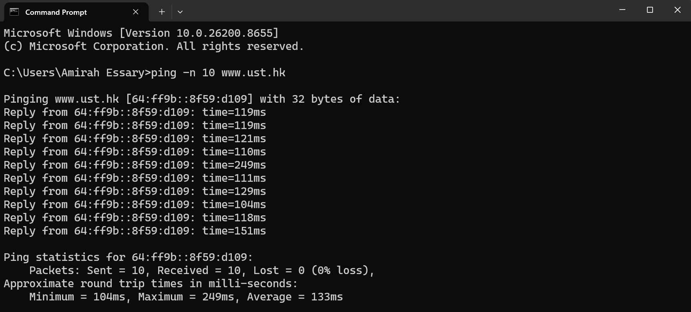
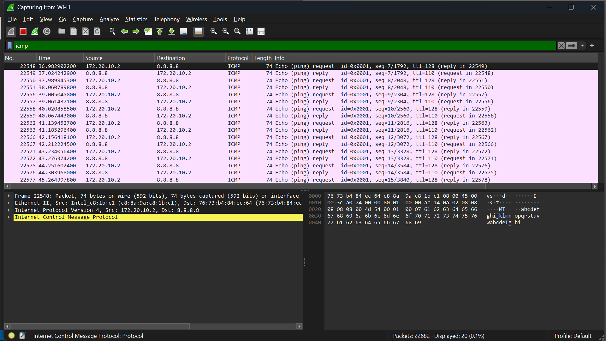
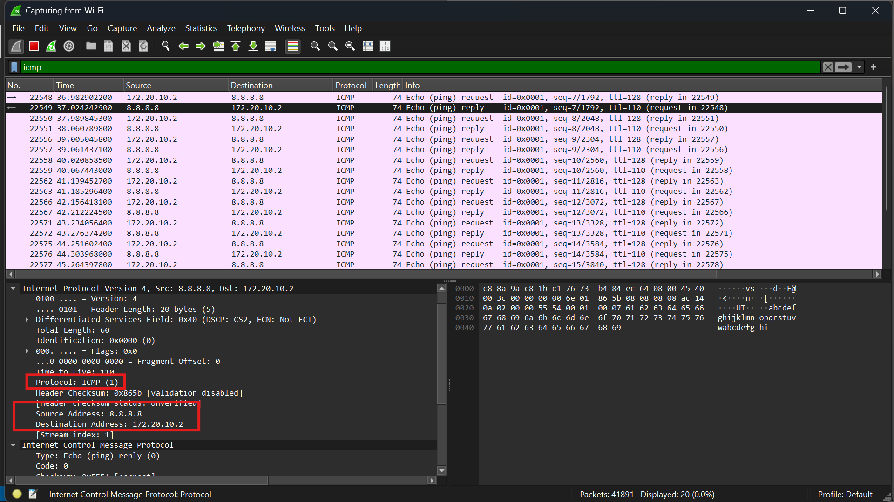
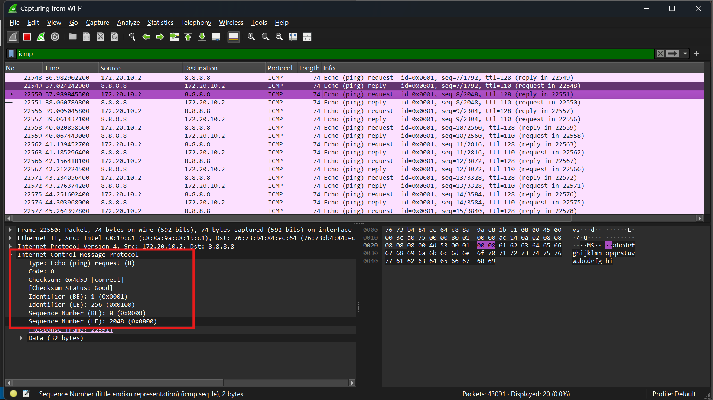
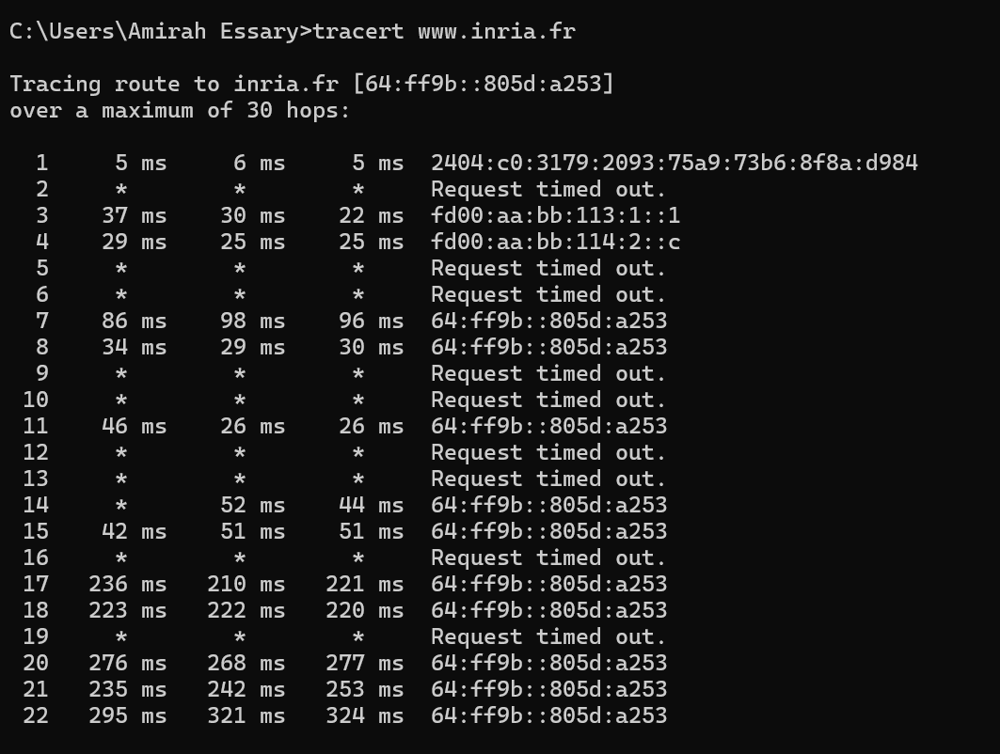
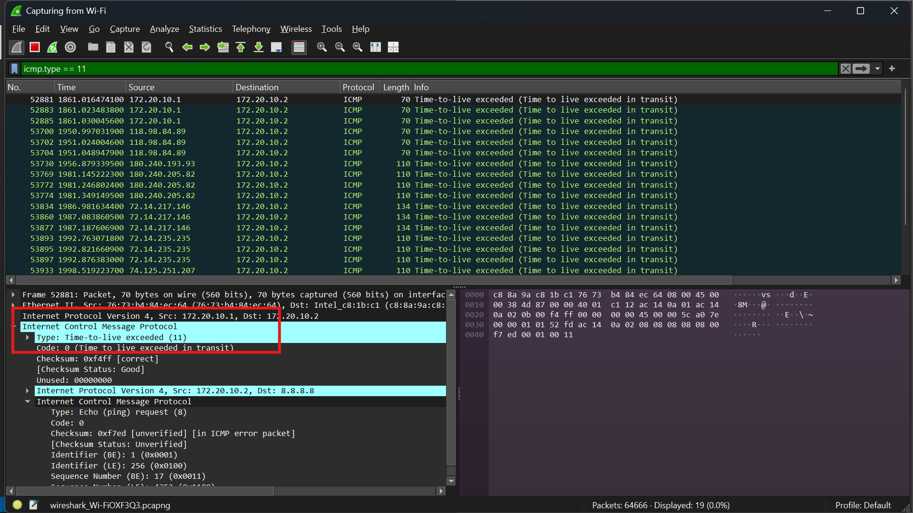
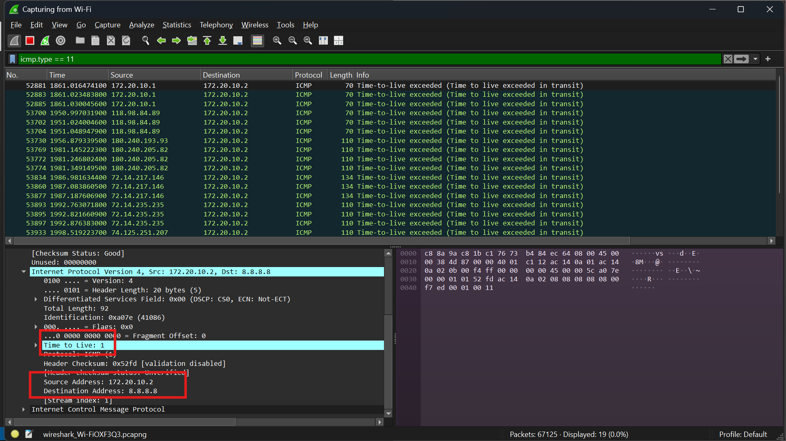

# LAPORAN PRAKTIKUM MODUL 12 : ICMP

## 1. Tujuan Praktikum

1. Memahami mekanisme kerja protokol ICMP melalui penggunaan Wireshark.  
2. Mengamati paket ICMP yang dihasilkan oleh perintah Ping.  
3. Mengamati paket ICMP yang dihasilkan oleh perintah Traceroute.  
4. Memahami struktur serta isi dari paket ICMP pada jaringan IP.  

## 2. Alat dan Bahan

* Wireshark  
* Command Prompt / Terminal  
* Koneksi internet  
* Sistem operasi Windows  

## 3. Langkah Percobaan

### 3.1 Menjalankan Ping

Pada sistem operasi Windows digunakan perintah:

```bash
ping -n 10 www.ust.hk
````

Perintah ini berfungsi untuk mengirimkan 10 paket ICMP Echo Request menuju host tujuan.

### 3.2 Menjalankan Wireshark

1. Menjalankan aplikasi Wireshark.
2. Memilih interface jaringan yang sedang aktif.
3. Memulai proses capture paket jaringan.
4. Menjalankan perintah ping dan tracert.
5. Menghentikan capture setelah proses selesai dilakukan.

### 3.3 Menjalankan Traceroute

Pada Windows digunakan perintah:

```bash
tracert www.inria.fr
```

Perintah ini digunakan untuk menelusuri jalur router yang dilewati menuju host tujuan dengan memanfaatkan paket ICMP.

## 4. Hasil dan Pembahasan

### 4.1 Hasil Ping pada Command Prompt



Pada gambar tersebut ditampilkan hasil eksekusi perintah ping yang mengirimkan paket ICMP ke alamat tujuan.

Program Ping bekerja dengan mengirimkan paket:

```text
ICMP Echo Request
```

ke host tujuan. Apabila host aktif dan dapat dijangkau, maka host akan memberikan balasan berupa:

```text
ICMP Echo Reply
```

Dari hasil pengamatan, seluruh paket berhasil terkirim dan mendapatkan respons kembali dari host tujuan.

Selain itu, terdapat informasi RTT (Round Trip Time), yaitu waktu yang dibutuhkan paket untuk mencapai host tujuan dan kembali lagi ke pengirim.

### 4.2 Paket ICMP pada Wireshark



Pada tampilan Wireshark terlihat paket ICMP yang dihasilkan selama proses ping berlangsung.

Paket tersebut terdiri atas:

* ICMP Echo Request
* ICMP Echo Reply

Setiap paket ICMP dikirimkan melalui protokol IP dengan nilai protokol:

```text
1
```

Nilai tersebut menunjukkan bahwa payload dari IP datagram adalah ICMP.

### 4.3 Header IPv4 pada Paket ICMP



Pada paket ICMP terdapat header IPv4 yang memiliki beberapa field penting sebagai berikut:

| Field               | Fungsi                              |
| ------------------- | ----------------------------------- |
| Version             | Menunjukkan versi IP yang digunakan |
| Header Length       | Panjang header pada paket IP        |
| Total Length        | Total ukuran keseluruhan datagram   |
| TTL                 | Batas jumlah hop yang dapat dilalui |
| Protocol            | Jenis protokol pada layer atas      |
| Source Address      | Alamat IP pengirim                  |
| Destination Address | Alamat IP tujuan                    |

Pada field Protocol terlihat nilai:

```text
1
```

yang menandakan bahwa protokol yang digunakan adalah ICMP.

### 4.4 ICMP Echo Request (Type 8)



Pada gambar tersebut terlihat paket:

```text
ICMP Echo Request
```

Paket ini memiliki parameter:

| Field | Nilai |
| ----- | ----- |
| Type  | 8     |
| Code  | 0     |

Nilai Type 8 menunjukkan bahwa paket tersebut merupakan Echo Request.

Paket ini dikirim oleh perangkat pengirim untuk mengecek ketersediaan host tujuan dalam jaringan.

Di dalam paket ICMP juga terdapat beberapa field tambahan seperti:

* Checksum
* Identifier
* Sequence Number

Sequence Number berfungsi untuk mencocokkan antara Echo Request dan Echo Reply yang diterima kembali.

### 4.5 Hasil Traceroute



Gambar tersebut menunjukkan hasil eksekusi perintah:

```bash
tracert www.inria.fr
```

Traceroute digunakan untuk mengetahui rute perjalanan paket menuju host tujuan melalui beberapa router.

Cara kerja traceroute adalah dengan mengirimkan paket menggunakan nilai TTL yang berbeda-beda.

Contoh:

| Paket         | TTL |
| ------------- | --- |
| Paket pertama | 1   |
| Paket kedua   | 2   |
| Paket ketiga  | 3   |

Setiap router yang dilewati akan mengurangi nilai TTL sebesar 1.

Ketika TTL bernilai 0, router akan mengirimkan pesan:

```text
ICMP Time Exceeded
```

kepada pengirim.

Dengan mekanisme ini, traceroute dapat memetakan jalur router yang dilalui paket.

### 4.6 ICMP Time Exceeded (Type 11)



Pada gambar tersebut terlihat paket:

```text
ICMP Time Exceeded
```

Paket ini dikirim oleh router ketika nilai TTL paket telah habis.

Paket tersebut memiliki parameter:

| Field | Nilai |
| ----- | ----- |
| Type  | 11    |
| Code  | 0     |

Type 11 menunjukkan pesan “Time To Live Exceeded”.

Pesan ini menginformasikan bahwa paket tidak dapat diteruskan karena TTL telah mencapai nol.

Fungsi inilah yang digunakan traceroute untuk mengetahui jalur jaringan.

### 4.7 Header ICMP



Header ICMP terdiri dari beberapa field penting sebagai berikut:

| Field           | Fungsi                               |
| --------------- | ------------------------------------ |
| Type            | Menentukan jenis pesan ICMP          |
| Code            | Menjelaskan detail dari pesan ICMP   |
| Checksum        | Digunakan untuk pengecekan kesalahan |
| Identifier      | Penanda identitas paket ICMP         |
| Sequence Number | Urutan paket ICMP                    |

Field Type dan Code digunakan untuk membedakan jenis pesan ICMP yang dikirimkan.

Contohnya:

* Type 8 = Echo Request
* Type 0 = Echo Reply
* Type 11 = Time Exceeded

### 4.8 Analisis Cara Kerja ICMP

ICMP (Internet Control Message Protocol) merupakan protokol yang digunakan untuk mengirimkan pesan kontrol serta informasi kesalahan dalam jaringan berbasis IP.

ICMP tidak digunakan untuk pengiriman data aplikasi, melainkan digunakan untuk fungsi seperti:

* pemeriksaan konektivitas jaringan
* pelaporan error jaringan
* proses diagnostik jaringan
* penelusuran rute (traceroute)

Pada praktikum ini diamati beberapa jenis pesan ICMP, yaitu:

| Type | Nama          |
| ---- | ------------- |
| 0    | Echo Reply    |
| 8    | Echo Request  |
| 11   | Time Exceeded |

Ping menggunakan kombinasi Echo Request dan Echo Reply untuk mengukur RTT serta mengecek konektivitas jaringan.

Traceroute memanfaatkan pesan Time Exceeded untuk mengidentifikasi router yang dilewati paket menuju tujuan.

## 5. Kesimpulan

Berdasarkan hasil praktikum yang dilakukan, ICMP merupakan protokol yang berfungsi untuk pertukaran pesan kontrol dan informasi kesalahan dalam jaringan IP. Perintah Ping menggunakan ICMP Echo Request dan Echo Reply untuk menguji konektivitas serta mengukur RTT. Sementara itu, Traceroute memanfaatkan ICMP Time Exceeded untuk mengetahui jalur router yang dilewati menuju host tujuan. Dengan bantuan Wireshark, seluruh proses ini dapat dianalisis secara rinci mulai dari header IPv4, header ICMP, hingga jenis-jenis pesan ICMP yang digunakan.