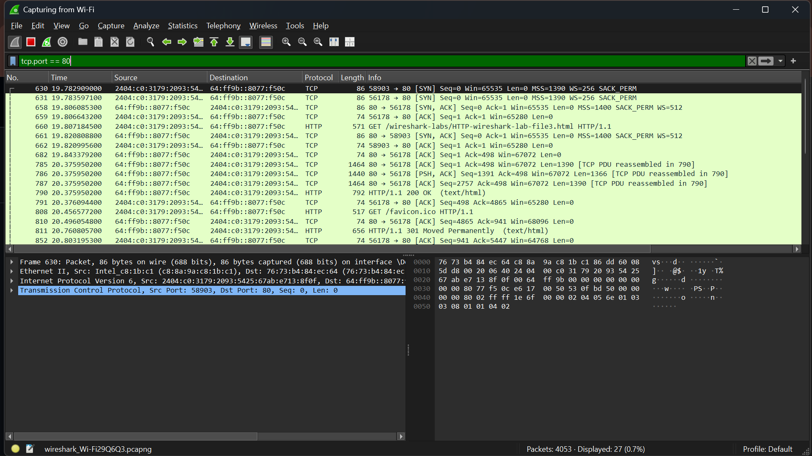
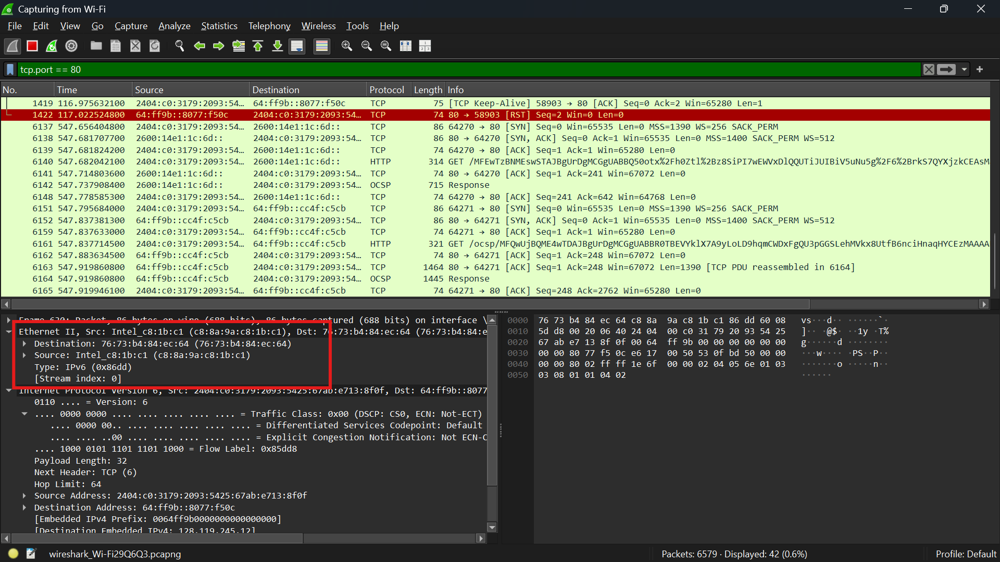
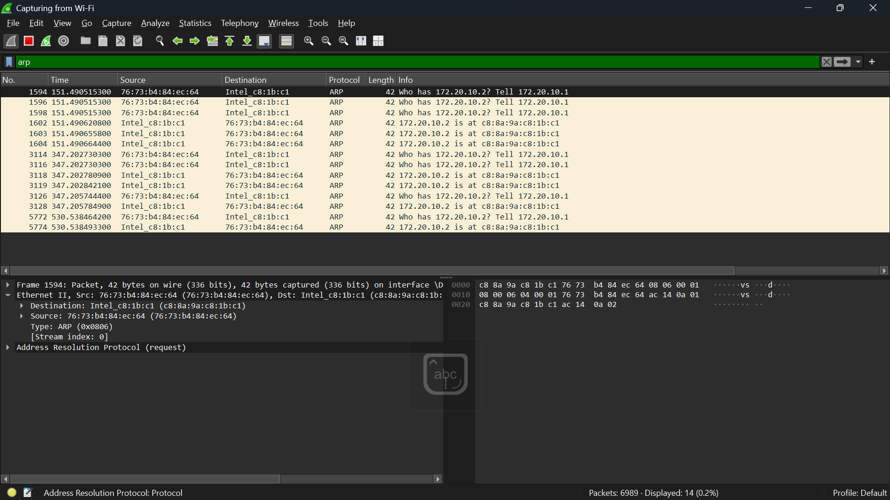
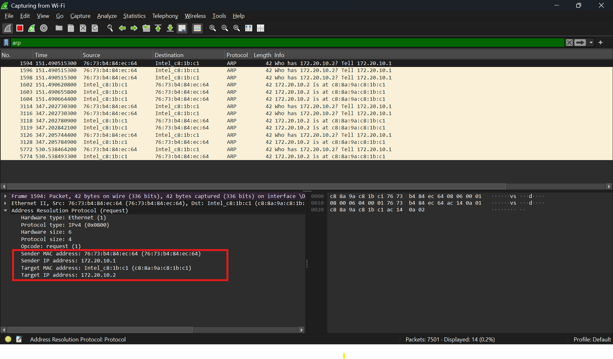

# LAPRORAN PRAKTIKUM MODUL 13 : ETHERNET DAN ARP

---

## 1. Tujuan Praktikum  
1. Memahami mekanisme kerja protokol Ethernet menggunakan Wireshark.  
2. Mengidentifikasi struktur frame Ethernet secara rinci.  
3. Memahami fungsi Address Resolution Protocol (ARP) dalam jaringan.  
4. Mengamati proses pertukaran ARP Request dan ARP Reply pada jaringan komputer.  

---

## 2. Alat dan Bahan  
- Wireshark  
- Web browser  
- Command Prompt / Terminal  
- Koneksi internet  

---

## 3. Langkah Percobaan  

### 3.1 Mengakses Halaman Web  
1. Membuka browser pada perangkat.  
2. Mengunjungi alamat berikut:  

```text
http://gaia.cs.umass.edu/wireshark-labs/HTTP-wireshark-lab-file3.html
```

3. Memastikan halaman web berhasil ditampilkan di browser.  

---

### 3.2 Proses Capture dengan Wireshark  
1. Menjalankan aplikasi Wireshark.  
2. Memilih interface jaringan yang sedang aktif digunakan.  
3. Memulai proses capture paket jaringan.  
4. Mengakses halaman web melalui browser.  
5. Menghentikan capture setelah proses loading halaman selesai.  

---

### 3.3 Filter TCP Port 80  
Pada Wireshark digunakan filter berikut:  

```text
tcp.port == 80
```

Filter ini digunakan untuk menampilkan seluruh paket komunikasi TCP yang berjalan pada port HTTP (80).  

---

### 3.4 Filter ARP  
Untuk menampilkan paket ARP digunakan filter:  

```text
arp
```

Filter tersebut berfungsi untuk menampilkan seluruh aktivitas protokol Address Resolution Protocol pada jaringan.  

---

## 4. Hasil dan Pembahasan  

### 4.1 Akses Halaman Web  


Dari hasil pengamatan, halaman web berikut berhasil diakses:  

```text
http://gaia.cs.umass.edu/wireshark-labs/HTTP-wireshark-lab-file3.html
```

Proses loading halaman terjadi melalui komunikasi jaringan yang melibatkan protokol TCP/IP serta Ethernet sebagai media pengiriman data di layer bawah.  

---

### 4.2 Analisis Trafik TCP Port 80  



Pada pengamatan ini, paket HTTP tidak muncul secara langsung saat menggunakan filter:  

```text
http
```

Hal ini terjadi karena Wireshark tidak selalu mengenali trafik sebagai HTTP secara otomatis. Oleh karena itu digunakan filter:  

```text
tcp.port == 80
```

Dengan filter tersebut, seluruh paket komunikasi pada port 80 dapat terlihat, termasuk koneksi antara client dan server `gaia.cs.umass.edu`.  

Pada hasil capture terlihat tahapan komunikasi TCP, yaitu:  
- SYN  
- SYN-ACK  
- ACK  
- PSH-ACK  
- FIN-ACK  

Tahapan tersebut menunjukkan proses pembentukan hingga terminasi koneksi TCP.  

---

### 4.3 Analisis Frame Ethernet II  



Dari hasil capture terlihat detail frame Ethernet II yang digunakan dalam pengiriman data pada jaringan lokal.  

Frame Ethernet terdiri dari beberapa komponen utama:  

| Field       | Fungsi                              |
|-------------|-------------------------------------|
| Destination | Alamat MAC perangkat tujuan         |
| Source      | Alamat MAC perangkat pengirim       |
| Type        | Menunjukkan protokol layer atas     |

Pada hasil pengamatan diperoleh:  

| Field           | Nilai             |
|----------------|------------------|
| Destination MAC | e8:43:68:3a:39:be |
| Source MAC      | b0:6b:11:53:91:8d |
| Type            | IPv4 (0x0800)     |

Nilai:  

```text
0x0800
```

menunjukkan bahwa payload pada frame tersebut merupakan paket IPv4.  

Ethernet sendiri beroperasi pada layer Data Link yang berfungsi sebagai penghubung komunikasi antar perangkat dalam satu jaringan lokal.  

---

### 4.4 Analisis MAC Address  

MAC Address merupakan identitas fisik unik yang dimiliki setiap perangkat jaringan.  

Contoh format MAC Address:  

```text
00:1A:2B:3C:4D:5E
```

Dalam proses komunikasi jaringan lokal, switch menggunakan MAC Address untuk meneruskan frame ke perangkat tujuan yang tepat.  

Source MAC menunjukkan perangkat pengirim, sedangkan Destination MAC menunjukkan perangkat penerima.  

---

### 4.5 ARP Request dan ARP Reply  



Pada hasil pengamatan terlihat pertukaran paket ARP Request dan ARP Reply.  

ARP Request digunakan untuk mencari alamat MAC berdasarkan alamat IP tertentu.  

Contoh pesan ARP Request:  

```text
Who has 192.168.1.31? Tell 192.168.1.2
```

Artinya perangkat dengan IP:  

```text
192.168.1.2
```

ingin mengetahui MAC Address dari perangkat:  

```text
192.168.1.31
```

ARP Request dikirim secara broadcast menggunakan alamat MAC:  

```text
ff:ff:ff:ff:ff:ff
```

karena alamat MAC tujuan belum diketahui.  

Setelah itu, perangkat tujuan akan mengirim ARP Reply yang berisi informasi MAC Address miliknya.  

---

### 4.6 Detail Paket ARP  



Pada detail paket ARP terlihat beberapa informasi penting:  

| Field              | Fungsi                     |
|-------------------|---------------------------|
| Sender MAC Address | MAC pengirim              |
| Sender IP Address  | IP pengirim               |
| Target MAC Address | MAC tujuan                |
| Target IP Address  | IP tujuan                 |

Hasil pengamatan menunjukkan:  

| Field              | Nilai             |
|-------------------|------------------|
| Sender MAC Address | a0:02:a5:ae:4c:78 |
| Sender IP Address  | 192.168.1.2       |
| Target IP Address  | 192.168.1.31      |

Target MAC Address masih:  

```text
00:00:00:00:00:00
```

karena belum diketahui oleh pengirim.  

ARP berfungsi untuk mengubah alamat IP menjadi MAC Address agar komunikasi pada layer Ethernet dapat berlangsung.  

---

### 4.7 Mekanisme Kerja ARP  

ARP (Address Resolution Protocol) bekerja untuk memetakan alamat IP ke alamat MAC.  

Tahapan proses ARP:  
1. Host menentukan IP tujuan.  
2. Host memeriksa ARP cache terlebih dahulu.  
3. Jika belum ada, host mengirim ARP Request secara broadcast.  
4. Perangkat tujuan mengirim ARP Reply.  
5. Hasil pemetaan disimpan dalam ARP cache.  

Dengan mekanisme ini, perangkat dapat menemukan alamat fisik tujuan sebelum mengirim data.  

---

### 4.8 Keterkaitan Ethernet dan ARP  

Ethernet dan ARP memiliki hubungan yang saling mendukung dalam komunikasi jaringan lokal.  

Ethernet bertugas mengirimkan frame data, sedangkan ARP berfungsi untuk menemukan MAC Address tujuan sebelum frame dikirimkan.  

Alur proses komunikasi:  
1. Menentukan IP tujuan.  
2. ARP mencari MAC Address tujuan.  
3. Ethernet mengirimkan frame menggunakan MAC Address tersebut.  

Tanpa ARP, perangkat tidak dapat melakukan pengiriman data di jaringan lokal karena tidak mengetahui alamat fisik tujuan.  

---

## 5. Kesimpulan  

Berdasarkan hasil praktikum, dapat disimpulkan bahwa Ethernet bekerja pada layer Data Link untuk mengirimkan frame antar perangkat dalam jaringan lokal dengan menggunakan alamat MAC. ARP berfungsi untuk menerjemahkan alamat IP menjadi MAC Address agar komunikasi dapat dilakukan dengan benar. Hasil pengamatan melalui Wireshark menunjukkan proses ARP Request dan ARP Reply serta struktur frame Ethernet secara jelas, sehingga mekanisme komunikasi jaringan dapat dipahami secara lebih mendalam.
```