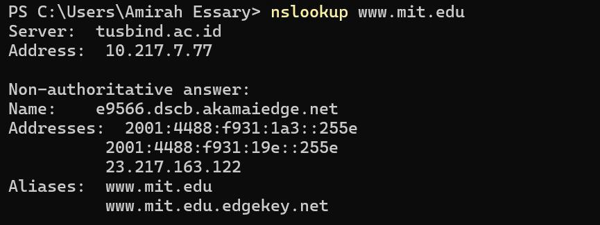
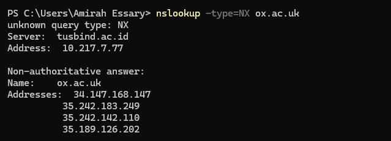
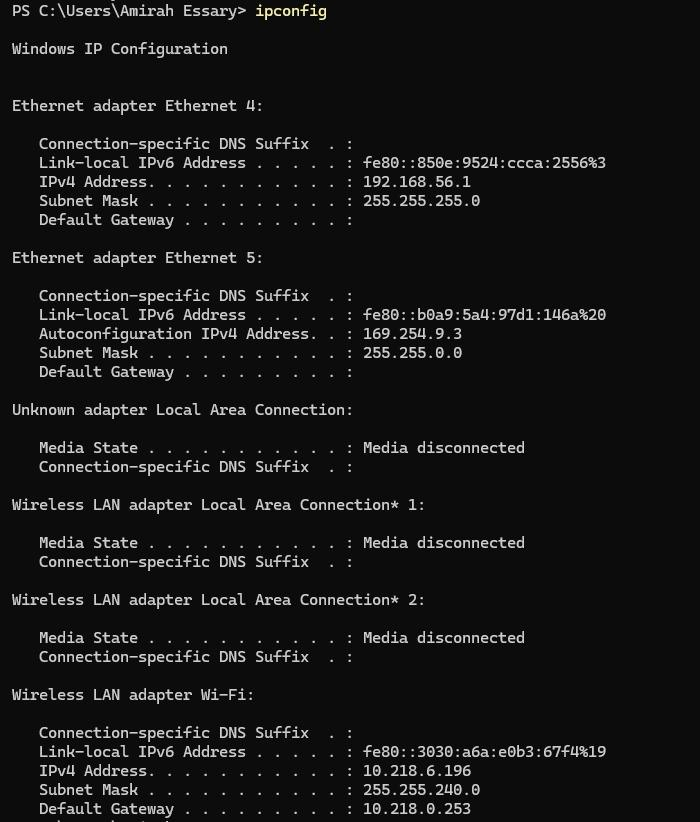
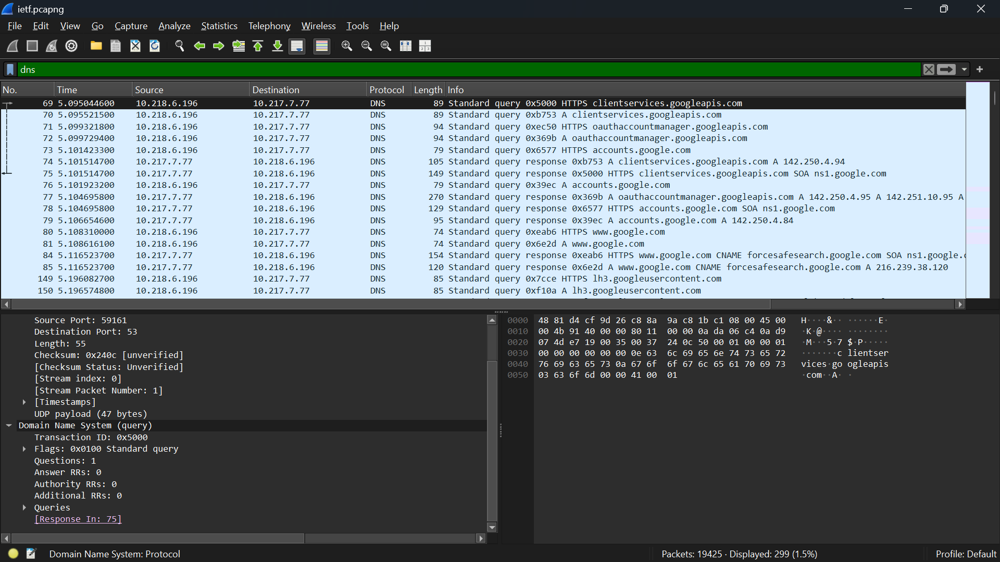

# LAPORAN PRAKTIKUM MODUL 4 : DNS

## Tujuan Praktikum
1. Mengetahui cara kerja DNS menggunakan Wireshark.
2. Memahami proses translasi nama domain menjadi alamat IP.
3. Menggunakan nslookup dan ipconfig untuk analisis DNS.
4. Mengamati proses DNS request dan DNS response pada jaringan.

---

## Alat dan Bahan
- Wireshark
- Browser
- Command Prompt / PowerShell
- Koneksi internet

---

# 4.2 NSLOOKUP

## 1. Nslookup Dasar

Perintah pertama yang digunakan adalah:

```bash
nslookup www.mit.edu
```

Perintah ini digunakan untuk meminta alamat IP dari domain `www.mit.edu`.

Hasil:



Pembahasan:

Pada hasil command prompt terlihat bahwa domain `www.mit.edu` berhasil diterjemahkan menjadi alamat IP oleh DNS server.

Hasil tersebut menampilkan:

* Nama dan alamat IP DNS server yang memberikan jawaban
* Nama host dan alamat IP domain `www.mit.edu`

Meskipun jawaban berasal dari DNS server lokal, DNS server tersebut dapat melakukan query secara iteratif ke server DNS lain untuk memperoleh jawaban.

Hal ini menunjukkan fungsi utama DNS yaitu menerjemahkan nama domain menjadi alamat IP agar dapat dikenali oleh komputer dalam jaringan.

---

## 2. Menampilkan DNS Authoritative Server

Perintah berikut digunakan untuk mengetahui authoritative name server suatu domain:

```bash
nslookup -type=NS ox.ac.uk
```

Perintah `-type=NS` digunakan untuk meminta record NS dari domain `ox.ac.uk`.

Hasil:


Pembahasan:

Pada hasil command prompt terlihat beberapa authoritative name server milik domain `ox.ac.uk`.

Record NS digunakan untuk mengetahui DNS server yang bertanggung jawab terhadap suatu domain.

Jawaban yang diberikan bersifat non-authoritative karena berasal dari cache DNS server lokal, bukan langsung dari authoritative DNS server domain tersebut.

Selain menampilkan nama server DNS, hasil juga dapat memberikan alamat IP server tersebut.

---

## 3. Menampilkan Mail Server Domain

Perintah berikut digunakan untuk mengetahui mail exchanger suatu domain:

```bash
nslookup -type=MX ox.ac.uk
```

Perintah `-type=MX` digunakan untuk meminta informasi mail server domain `ox.ac.uk`.

Hasil:


Pembahasan:

Pada hasil command prompt terlihat bahwa domain `ox.ac.uk` memiliki mail exchanger:

* `oxforduni.in.tmes.trendmicro.eu`

dengan MX preference sebesar 4.

Record MX digunakan untuk mengetahui server email yang menangani proses pengiriman dan penerimaan email pada suatu domain.

---

## 4. Pengujian Query Type Tidak Valid

Perintah berikut digunakan untuk mencoba query type yang tidak valid:

```bash
nslookup -type=NX ox.ac.uk
```

Hasil:



Pembahasan:

Pada percobaan ini digunakan query type `NX` yang sebenarnya tidak valid pada `nslookup`.

Sistem menampilkan pesan:

```text
unknown query type: NX
```

Namun DNS server tetap memberikan hasil berupa alamat IP domain `ox.ac.uk`, yaitu:

* 34.147.168.147
* 35.242.183.249
* 35.242.142.110
* 35.189.126.202

Hal ini menunjukkan bahwa query DNS harus menggunakan tipe yang valid seperti A, MX, NS, atau CNAME.

---

## 5. Pengujian Nslookup Domain Telkom University

Perintah berikut digunakan untuk mencari alamat IP domain Telkom University:

```bash
nslookup lms.telkomuniversity.ac.id
```

Hasil:


Pembahasan:

Pada percobaan ini digunakan perintah `nslookup` untuk mencari alamat IP domain `lms.telkomuniversity.ac.id`.

Hasil menunjukkan beberapa alamat IPv4 dan IPv6, yaitu:

IPv6 Address:

* `2606:4700:3034::6815:50c1`
* `2606:4700:3030::ac43:994d`

IPv4 Address:

* `172.67.153.77`
* `104.21.80.193`

Selain itu terdapat alias domain:

* `proxy-fallback.celoe.in`

Hal ini menunjukkan bahwa domain Telkom University menggunakan beberapa alamat IP dan layanan CDN untuk meningkatkan performa dan ketersediaan layanan.

---

## 6. Nslookup Menggunakan DNS Server Tertentu

Perintah berikut digunakan untuk melakukan query menggunakan DNS server tertentu:

```bash
nslookup www.aiit.or.kr bitsy.mit.edu
```

Hasil:


Pembahasan:

Pada percobaan ini digunakan DNS server tertentu yaitu `bitsy.mit.edu` untuk melakukan query domain `www.aiit.or.kr`.

Dengan demikian pertukaran informasi terjadi langsung antara host dan server DNS tersebut, bukan menggunakan DNS server default lokal.

Hasil menunjukkan bahwa DNS query dapat dilakukan menggunakan server DNS selain server default.

Domain `www.aiit.or.kr` merupakan server web milik Advanced Institute of Information Technology di Korea.

---

## 7. Pengujian Mandiri

### 1. Jalankan nslookup untuk mendapatkan alamat IP dari server web di Korea.

Perintah yang digunakan:

```bash
nslookup www.aiit.or.kr bitsy.mit.edu
```

Hasil menunjukkan bahwa domain `www.aiit.or.kr` berhasil diterjemahkan menjadi alamat IP oleh DNS server `bitsy.mit.edu`.

Server tersebut merupakan server web milik Advanced Institute of Information Technology di Korea.

---

### 2. Jalankan nslookup untuk mengetahui server DNS otoritatif universitas di Eropa.

Perintah yang digunakan:

```bash
nslookup -type=NS ox.ac.uk
```

Hasil menunjukkan beberapa authoritative name server milik domain `ox.ac.uk`.

---

### 3. Jalankan nslookup untuk mengetahui informasi server email Yahoo! Mail.

Perintah yang digunakan:

```bash
nslookup -type=MX yahoo.com
```

Hasil menunjukkan mail exchanger yang digunakan Yahoo! Mail untuk pengiriman dan penerimaan email.

```
```

# 4.3 IPCONFIG

## 1. Menampilkan Konfigurasi IP Dasar

Langkah percobaan:

1. Membuka Command Prompt / PowerShell.
2. Menjalankan perintah berikut:

```bash
ipconfig
```

3. Mengamati konfigurasi jaringan dasar.

Hasil:



Pembahasan:

Perintah `ipconfig` digunakan untuk menampilkan konfigurasi IP dasar dari adapter jaringan yang aktif.

Informasi yang ditampilkan meliputi:

* IPv4 Address
* Subnet Mask
* Default Gateway

Informasi tersebut digunakan untuk mengetahui konfigurasi dasar jaringan host yang sedang digunakan.

---

## 2. Menampilkan Seluruh Konfigurasi Jaringan

Langkah percobaan:

1. Membuka Command Prompt / PowerShell.
2. Menjalankan perintah berikut:

```bash
ipconfig /all
```

3. Mengamati informasi jaringan lengkap.

Hasil:


Pembahasan:

Perintah `ipconfig /all` digunakan untuk menampilkan seluruh konfigurasi jaringan secara lengkap.

Informasi yang ditampilkan meliputi:

* Host Name
* Physical Address (MAC Address)
* DHCP Status
* IPv4 Address
* IPv6 Address
* DNS Server
* Default Gateway

Perintah ini sangat berguna untuk melakukan analisis dan troubleshooting jaringan.

---

## 3. Menampilkan DNS Cache

Langkah percobaan:

1. Membuka Command Prompt / PowerShell.
2. Menjalankan perintah berikut:

```bash
ipconfig /displaydns
```

3. Mengamati daftar DNS cache.

Hasil:


Pembahasan:

Perintah `ipconfig /displaydns` digunakan untuk menampilkan record DNS yang tersimpan pada DNS Resolver Cache host.

Pada hasil terlihat beberapa domain beserta:

* Record Name
* Record Type
* Time To Live (TTL)
* Data Length
* IP Address

DNS cache digunakan untuk mempercepat proses translasi domain tanpa harus melakukan query ulang ke DNS server.

---

## 4. Menghapus DNS Cache

Langkah percobaan:

1. Membuka Command Prompt / PowerShell.
2. Menjalankan perintah berikut:

```bash
ipconfig /flushdns
```

3. Mengamati hasil penghapusan DNS cache.

Hasil:


Pembahasan:

Perintah `ipconfig /flushdns` digunakan untuk menghapus seluruh DNS Resolver Cache yang tersimpan pada sistem operasi Windows.

Menghapus DNS cache berarti membersihkan seluruh record DNS yang tersimpan sehingga host akan meminta informasi DNS terbaru langsung dari DNS server.

---

# 4.4 TRACING DNS DENGAN WIRESHARK

Pada bagian ini dilakukan proses capture paket DNS menggunakan Wireshark untuk mengamati komunikasi DNS request dan DNS response saat browser mengakses website.

---

## 1. Tracing DNS Menggunakan Wireshark

Langkah percobaan:

1. Menghapus DNS cache menggunakan:

```bash
ipconfig /flushdns
```
Hasil


2. Membuka browser dan menghapus cache browser.
3. Membuka aplikasi Wireshark.
4. Memasukkan filter:

```bash
ip.addr == alamat_IP
```

5. Menjalankan proses capture paket.
6. Membuka browser dan mengakses website berikut:

```text
http://www.ietf.org
```

7. Menghentikan proses capture paket.
8. Menggunakan filter:

```bash
dns
```

9. Mengamati paket DNS request dan DNS response.

Hasil:



Pembahasan:

Pada hasil capture Wireshark terlihat paket DNS request dan DNS response ketika browser mengakses website `www.ietf.org`.

DNS request dikirim oleh host menuju DNS server untuk meminta alamat IP domain tujuan. Setelah itu DNS server memberikan DNS response berupa alamat IP domain sehingga browser dapat melakukan koneksi ke server website.

---

# Analisa 4.4.1

## 1. Apakah pesan DNS dikirim menggunakan UDP atau TCP?

Pesan DNS pada praktikum ini dikirim menggunakan protokol UDP.

---

## 2. Apa port tujuan pada pesan permintaan DNS? Apa port sumber pada pesan balasannya?

* Port tujuan DNS request adalah port 53.
* Port sumber DNS response juga berasal dari port 53.

---

## 3. Pada pesan permintaan DNS, apa alamat IP tujuannya? Apakah sama dengan DNS server lokal?

Alamat IP tujuan DNS request adalah alamat IP DNS server lokal yang digunakan host.

Alamat tersebut dapat diketahui melalui perintah:

```bash
ipconfig /all
```

Hasil menunjukkan bahwa alamat IP tujuan DNS request sama dengan DNS server lokal.

---

## 4. Apa type dari pesan DNS request? Apakah memiliki answer?

Type DNS request yang digunakan adalah type A.

DNS request tidak memiliki answer karena hanya berisi permintaan informasi domain.

---

## 5. Berapa jumlah answer pada DNS response? Apa isi setiap answer?

DNS response dapat memiliki satu atau lebih answer.

Isi answer biasanya berupa:

* Nama domain
* Type record
* TTL
* Alamat IP domain tujuan

---

## 6. Apakah alamat IP pada paket TCP SYN sesuai dengan DNS response?

Ya. Alamat IP pada paket TCP SYN sesuai dengan alamat IP hasil DNS response karena browser menggunakan hasil translasi DNS untuk membangun koneksi TCP.

---

## 7. Apakah host perlu mengirim DNS request baru setiap kali mengakses gambar?

Tidak selalu.

Host dapat menggunakan DNS cache yang sudah tersimpan sehingga tidak perlu melakukan DNS request baru untuk setiap gambar yang diakses.

```
```
