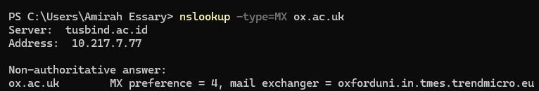

## 1. Nslookup

Pada praktikum ini digunakan perintah `nslookup` untuk mengetahui informasi DNS seperti alamat IP, DNS server otoritatif, dan mail server suatu domain.

---

### a. Mendapatkan Alamat IP Server Web di Asia

Perintah:

nslookup www.mit.edu

#### Hasil

#### Pembahasan dan Jawaban
Perintah ini digunakan untuk mengetahui alamat IP dari domain **www.mit.edu**.

Alamat IP server:
- 23.217.163.122
- 2001:4488:f931:1a3::255e
- 2001:4488:f931:19e::255e

Hal ini menunjukkan bahwa satu domain dapat memiliki beberapa alamat IP (IPv4 dan IPv6) karena adanya **load balancing** dan penggunaan **Content Delivery Network (CDN)**.

---

### b. Mengetahui DNS Server Otoritatif Universitas di Eropa

Perintah:

nslookup -type=NS ox.ac.uk

#### Hasil

#### Pembahasan dan Jawaban
Perintah ini digunakan untuk mengetahui DNS server otoritatif dari domain **ox.ac.uk**.

Server DNS otoritatif:
- oxforduni.in.tmes.trendmicro.eu

DNS server otoritatif merupakan server yang menyimpan data resmi dari suatu domain.

---

### c. Mengetahui Mail Server Yahoo dan Alamat IP

Perintah:

nslookup -type=MX yahoo.com

#### Hasil

#### Pembahasan dan Jawaban
Perintah ini digunakan untuk mengetahui mail server dari domain **yahoo.com**.

Mail server:
- mta5.am0.yahoodns.net
- mta6.am0.yahoodns.net

Alamat IP:
- (isi sesuai hasil pada screenshot kamu)

Mail server digunakan untuk menangani pengiriman dan penerimaan email. Adanya beberapa server menunjukkan adanya sistem **redundansi** untuk meningkatkan keandalan layanan.

---

### d. Nslookup Domain Lain (Tambahan)

Perintah:

nslookup lms.telkomuniversity.ac.id

#### Hasil

#### Pembahasan
Perintah ini digunakan untuk mengetahui alamat IP domain lain sebagai perbandingan.

Hasil menunjukkan bahwa domain tersebut memiliki beberapa alamat IP (IPv4 dan IPv6), yang menandakan adanya distribusi server untuk meningkatkan performa dan keandalan akses.

---