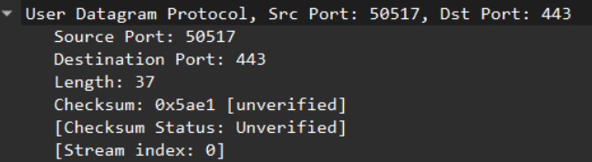
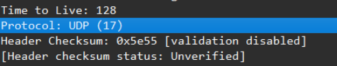
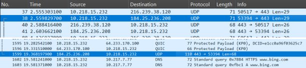
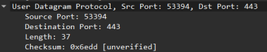
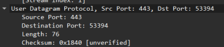

# LAPORAN PRAKTIKUM MODUL 5 : UDP

## Tujuan Praktikum
1. Mahasiswa dapat menginvestigasi cara kerja protokol UDP menggunakan Wireshark.

---

# 5.1 Pengantar

Di modul ini, dilakukan pengamatan terhadap protokol transport UDP (*User Datagram Protocol*) menggunakan aplikasi Wireshark. UDP merupakan protokol transport yang sederhana dan tidak memiliki mekanisme koneksi seperti TCP.

Pada praktikum ini dilakukan proses penangkapan paket (*packet capture*) untuk melihat komunikasi UDP yang terjadi pada jaringan. Setelah paket berhasil ditangkap, paket UDP dianalisis untuk mengetahui struktur header, panjang field, nomor port, serta hubungan paket request dan response.

---

# 5.2 Alat dan Bahan

- Wireshark  
- Laptop/PC  
- Koneksi Internet  

---

# 5.3 Langkah Percobaan

1. Membuka aplikasi Wireshark.
2. Memulai proses *capture packet* pada jaringan yang digunakan.
3. Melakukan aktivitas jaringan sehingga menghasilkan paket UDP.
4. Menghentikan proses penangkapan paket.
5. Menggunakan filter `udp` pada Wireshark untuk menampilkan paket UDP saja.
6. Memilih salah satu paket UDP untuk dianalisis.
7. Mengamati field-field pada header UDP serta informasi paket lainnya.

---

# 5.4 Hasil dan Pembahasan

## 1. Pilih satu paket UDP yang terdapat pada trace Anda. Dari paket tersebut, berapa banyak “field” yang terdapat pada header UDP? Sebutkan nama-nama field yang Anda temukan!



### Jawaban

Didapatkan field sebagai berikut:

- **Source Port (Port Asal)** : 50517  
  Source port menunjukkan nomor port dari aplikasi pengirim.

- **Destination Port (Port Tujuan)** : 443  
  Field ini menunjukkan nomor port tujuan, yaitu aplikasi atau layanan yang menerima data.

- **Length (Panjang Paket UDP)** : 37  
  Field ini menunjukkan panjang total segmen UDP, yaitu gabungan antara ukuran header UDP dan ukuran data (*payload*).

- **Checksum** : Belum diverifikasi  
  Field ini digunakan untuk mendeteksi kesalahan (*error detection*) pada header dan data (*payload*).

---

## 2. Perhatikan informasi “content field” pada paket yang Anda pilih di pertanyaan 1. Berapa panjang (dalam satuan byte) masing-masing “field” yang terdapat pada header UDP?


### Jawaban

Header UDP memiliki ukuran tetap yaitu **8 byte**. Header ini terdiri dari **4 field** dan masing-masing field memiliki panjang **2 byte**.

---

## 3. Nilai yang tertera pada “Length” menyatakan nilai apa? Verifikasi jawaban Anda melalui paket UDP pada trace.


### Jawaban

Nilai pada field **Length** menunjukkan panjang total UDP yang terdiri dari:

- Header UDP = 8 byte
- Data/Payload = 29 byte

Sehingga total panjang UDP:

```text
8 byte + 29 byte = 37 byte
```

---

## 4. Berapa jumlah maksimum byte yang dapat disertakan dalam payload UDP?

### Jawaban

Perhitungan panjang maksimum payload UDP:

- Panjang total UDP = Header UDP + Data (*Payload*)
- Total header UDP selalu = 8 byte
- Field Length UDP menggunakan 16 bit

Maka:

```text
2^16 - 1 = 65.535 byte
```

Payload maksimum:

```text
65.535 - 8 = 65.527 byte
```

Jadi jumlah maksimum payload UDP adalah **65.527 byte**.

---

## 5. Berapa nomor port terbesar yang dapat menjadi port sumber?

### Jawaban

Field **Source Port** memiliki ukuran **16 bit (2 byte)**.

Maka nilai maksimum:

```text
2^16 - 1 = 65.535
```

Jadi nomor port terbesar adalah **65.535**.

---

## 6. Berapa nomor protokol untuk UDP? Berikan jawaban Anda dalam notasi heksadesimal dan desimal.



### Jawaban

Protocol UDP memiliki:

- Desimal : **17**
- Heksadesimal : **0x11**

---

## 7. Periksa pasangan paket UDP di mana host Anda mengirimkan paket UDP pertama dan paket UDP kedua merupakan balasan dari paket UDP yang pertama.




### Query


### Response


### Jawaban

Pasangan paket UDP di atas menunjukkan bahwa nomor port pada paket kedua merupakan kebalikan dari paket pertama.

- Port sumber pada paket pertama menjadi port tujuan pada paket kedua.
- Port tujuan pada paket pertama menjadi port sumber pada paket kedua.

Pertukaran ini menunjukkan bahwa paket kedua merupakan respons langsung dari paket pertama.

---

# 5.5 Kesimpulan

Berdasarkan hasil praktikum, dapat disimpulkan bahwa protokol UDP memiliki struktur header yang sederhana dengan ukuran tetap sebesar 8 byte. UDP tidak menggunakan mekanisme koneksi seperti TCP sehingga proses komunikasi menjadi lebih cepat dan ringan.

Melalui Wireshark, paket UDP dapat dianalisis untuk mengetahui informasi seperti source port, destination port, length, dan checksum. Selain itu, hubungan antara paket request dan response juga dapat diamati melalui pertukaran nomor port antar paket.
